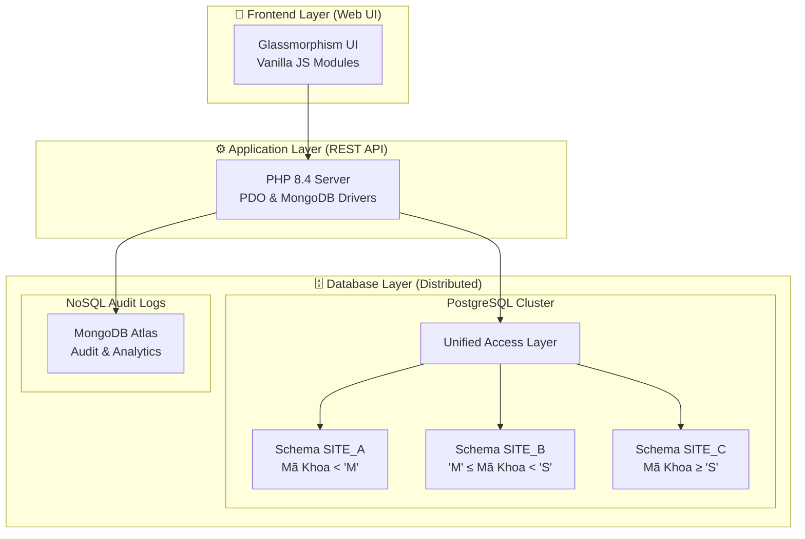

# 🏗️ Kiến trúc Hệ thống - HUFLIT Distributed Database (PostgreSQL Edition)

Tài liệu này chi tiết về cấu trúc và cơ chế hoạt động của hệ thống CSDL phân tán phiên bản PostgreSQL. Dự án đã chuyển đổi từ mô hình MSSQL Linked Servers nặng nề sang mô hình **PostgreSQL Schemas** linh hoạt và nhẹ nhàng hơn.

---

## 📋 Mục lục
- [📊 Tổng quan kiến trúc](#-tổng-quan-kiến-trúc)
- [🗄️ Database Layer - Lớp dữ liệu phân tán](#️-database-layer---lớp-dữ-liệu-phân-tán)
- [🔧 Application Layer - Lớp ứng dụng](#-application-layer---lớp-ứng-dụng)
- [🔄 Data Flow - Luồng dữ liệu](#-data-flow---luồng-dữ-liệu)
- [🌐 Cloud Deployment - Triển khai đám mây](#-cloud-deployment---triển-khai-đám-mây)

---

## 📊 Tổng quan kiến trúc

Hệ thống được thiết kế theo mô hình **Client-Server** với sự phân cấp rõ ràng giữa các tầng:

---

## 🗄️ Database Layer - Lớp dữ liệu phân tán

Thay vì sử dụng các Server vật lý khác nhau (rất tốn tài nguyên), chúng tôi sử dụng cơ chế **Schemas** của PostgreSQL để đóng gói các Site phân tán.

### 1. Cấu trúc Fragments (Phân mảnh ngang)
Dữ liệu được phân mảnh ngang dựa trên thuộc tính **MaKhoa**:

- **Site A (`site_a`)**: Lưu các khoa có mã bắt đầu từ A đến L.
- **Site B (`site_b`)**: Lưu các khoa có mã bắt đầu từ M đến R.
- **Site C (`site_c`)**: Lưu các khoa có mã bắt đầu từ S đến Z.
- **Replication**: Bảng `MonHoc` được nhân bản (Replicated) trên tất cả các Site để đảm bảo hiệu năng truy vấn JOIN.

### 2. Global Views & Triggers
Tại Schema `public` (hoặc `global`), chúng tôi tạo các **View** hợp nhất dữ liệu từ cả 3 Site bằng lệnh `UNION ALL`.
Để thực hiện INSERT/UPDATE trên các View này, hệ thống sử dụng **Triggers** (Hàm chuyển hướng) để tự động đẩy dữ liệu về đúng Site dựa trên logic `MaKhoa`.

---

## 🔧 Application Layer - Lớp ứng dụng

### 1. PHP REST API
Hệ thống Backend được viết bằng PHP thuần (không framework) để tối đa tốc độ:
- **PDO**: Kết nối tới PostgreSQL.
- **MongoDB Driver**: Ghi log thao tác dữ liệu ngay khi API được gọi.

### 2. Modern Frontend
Giao diện được xây dựng bằng **Vanilla JS (ES6 Modules)** với phong cách **Glassmorphism**:
- Không sử dụng thư viện nặng nề như React/Angular, giúp tải trang cực nhanh.
- Sử dụng CSS Variables để hỗ trợ đổi màu (Theme) thời gian thực.

---

## 🔄 Data Flow - Luồng dữ liệu (Ví dụ INSERT)

1. **Người dùng** nhấn nút "Lưu" trên giao diện.
2. **Frontend** gửi request POST chứa JSON sinh viên tới API.
3. **API (PHP)** nhận dữ liệu, mở kết nối tới PostgreSQL Unified Layer.
4. **PostgreSQL** nhận lệnh INSERT trên View toàn cục.
5. **Trigger** phân tích `MaKhoa` của sinh viên đó (VD: 'CNTT').
6. **Trigger** tự động thực hiện lệnh INSERT thực sự vào bảng `site_a.sinhvien`.
7. **API** nhận kết quả thành công, gửi log sang **MongoDB Atlas** và phản hồi về browser.

---

## 🌐 Cloud Deployment - Triển khai đám mây

Hệ thống được tối ưu hóa cho các dịch vụ Cloud hiện đại:
- **Neon.tech**: Cung cấp PostgreSQL Serverless mạnh mẽ, cho phép tách Schema dễ dàng.
- **MongoDB Atlas**: Lưu trữ nhật ký Audit trên đám mây, đảm bảo tính vĩnh cữu của log.
- **Render.com**: Hosting cho ứng dụng PHP với khả năng auto-scale.

---
© 2025 - Tài liệu Kiến trúc Hệ thống Phân tán HUFLIT
