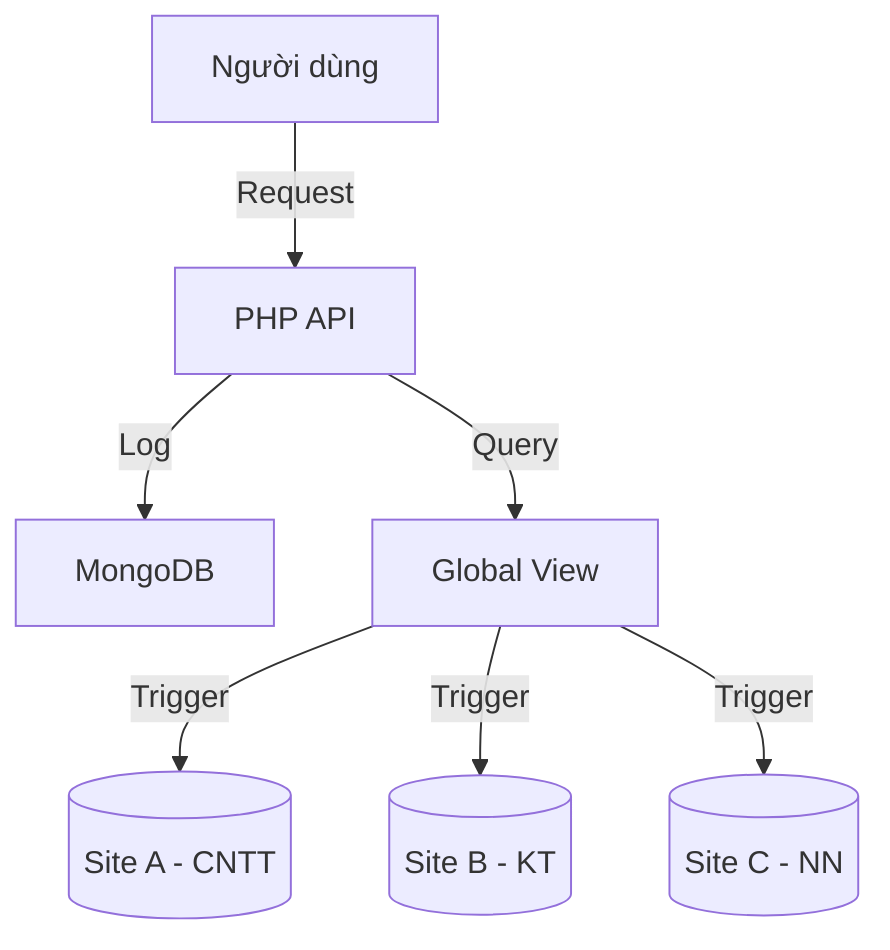

# BÁO CÁO ĐỒ ÁN: HỆ THỐNG CƠ SỞ DỮ LIỆU PHÂN TÁN HUFLIT

**TRƯỜNG ĐẠI HỌC CÔNG NGHỆ THÔNG TIN VÀ TRUYỀN THÔNG - HUFLIT**  
**KHOA: CÔNG NGHỆ THÔNG TIN**  
**MÔN HỌC: CƠ SỞ DỮ LIỆU PHÂN TÁN**  
**ĐỀ TÀI: HỆ THỐNG QUẢN LÝ SINH VIÊN PHÂN TÁN THEO KHOA**  

**NHÓM THỰC HIỆN:**  
- Sinh viên 1: [Tên SV1] - [MSSV]  
- Sinh viên 2: [Tên SV2] - [MSSV]  
- Sinh viên 3: [Tên SV3] - [MSSV]  

**GIẢNG VIÊN HƯỚNG DẪN:**  
ThS. [Tên GVHD]  

**THỜI GIAN NỘP:**  
Tháng 11, 2025  

---

## TÓM TẮT NỘI DUNG

Hệ thống Cơ sở dữ liệu phân tán HUFLIT là một giải pháp toàn diện cho việc quản lý dữ liệu sinh viên được phân tán theo các khoa đào tạo. Dự án triển khai thành công các khái niệm lý thuyết về cơ sở dữ liệu phân tán vào thực tế thông qua việc xây dựng hệ thống 3-tier với kiến trúc phân mảnh theo range partitioning.

**Những nội dung chính của báo cáo:**

1. **Giới thiệu:** Lý do chọn đề tài, mục tiêu ứng dụng và phạm vi nghiên cứu
2. **Tổng quan CSDL PT:** Các khái niệm nền tảng về distributed databases, mức độ transparency, chiến lược phân mảnh, xử lý truy vấn và cơ sở dữ liệu song song
3. **Quy trình thực hiện:** Timeline 8 tuần, data flow diagrams, RACI matrix và risk management
4. **Sản phẩm Demo:** User stories, wireframes, demo scenarios và technical scripts
5. **Kết quả và Đánh giá:** SWOT analysis, technical debt assessment, ROI calculation và performance benchmarks
6. **Kết luận:** Roadmap phát triển, technology recommendations và lessons learned

**Kết quả đạt được:**
- Hệ thống demo hoàn chỉnh với 6 containers Docker
- 15 INSTEAD OF triggers cho routing tự động
- 4 loại truy vấn phân tán với JOIN phức tạp
- Audit logging real-time với MongoDB
- Web UI responsive với JavaScript ES6
- Performance benchmarks và scalability testing

**Từ khóa:** Cơ sở dữ liệu phân tán, range partitioning, INSTEAD OF triggers, Docker, MongoDB, distributed query processing.

---

## MỤC LỤC

- [DANH MỤC HÌNH ẢNH](#danh-mục-hình-ảnh)
- [DANH MỤC BẢNG BIỂU](#danh-mục-bảng-biểu)
- [DANH MỤC TỪ VIẾT TẮT](#danh-mục-từ-viết-tắt)

- [CHƯƠNG 1: GIỚI THIỆU](#chương-1-giới-thiệu)
  - [1.1 Lý do chọn đề tài](#11-lý-do-chọn-đề-tài)
  - [1.2 Mục tiêu ứng dụng](#12-mục-tiêu-ứng-dụng)
  - [1.3 Phạm vi nghiên cứu/ứng dụng](#13-phạm-vi-nghiên-cứuứng-dụng)
  - [1.4 Cấu trúc báo cáo](#14-cấu-trúc-báo-cáo)

- [CHƯƠNG 2: TỔNG QUAN VỀ CSDL PT](#chương-2-tổng-quan-về-csdl-pt)
  - [2.1 Tổng quan về CSDL Phân tán](#21-tổng-quan-về-csdl-phân-tán)
  - [2.2 Các mức trong suốt phân tán](#22-các-mức-trong-suốt-phân-tán)
  - [2.3 Thiết kế CSDLPT](#23-thiết-kế-csdlpt)
  - [2.4 Xử lý truy vấn trong CSDL phân tán](#24-xử-lý-truy-vấn-trong-csdl-phân-tán)
  - [2.5 Cơ sở dữ liệu song song](#25-cơ-sở-dữ-liệu-song-song)

- [CHƯƠNG 3: QUY TRÌNH THỰC HIỆN](#chương-3-quy-trình-thực-hiện)
  - [3.1 Các bước triển khai](#31-các-bước-triển-khai)
  - [3.2 Sơ đồ/mô hình quy trình](#32-sơ-đồ-mô-hình-quy-trình)
  - [3.3 Phân công công việc trong nhóm](#33-phân-công-công-việc-trong-nhóm)

- [CHƯƠNG 4: SẢN PHẨM DEMO](#chương-4-sản-phẩm-demo)
  - [4.1 Mô tả sản phẩm](#41-mô-tả-sản-phẩm)
  - [4.2 Ảnh minh họa, link/QR code demo](#42-ảnh-minh-họa-linkqr-code-demo)

- [CHƯƠNG 5: KẾT QUẢ VÀ ĐÁNH GIÁ](#chương-5-kết-quả-và-đánh-giá)
  - [5.1 Kết quả đạt được so với mục tiêu](#51-kết-quả-đạt-được-so-với-mục-tiêu)
  - [5.2 Ưu điểm, hạn chế](#52-ưu-điểm-hạn-chế)
  - [5.3 Khả năng ứng dụng thực tế](#53-khả-năng-ứng-dụng-thực-tế)

- [CHƯƠNG 6: KẾT LUẬN VÀ HƯỚNG PHÁT TRIỂN](#chương-6-kết-luận-và-hướng-phát-triển)
  - [6.1 Tóm tắt nội dung đạt được](#61-tóm-tắt-nội-dung-đạt-được)
  - [6.2 Bài học kinh nghiệm](#62-bài-học-kinh-nghiệm)
  - [6.3 Đề xuất mở rộng](#63-đề-xuất-mở-rộng)

---

## DANH MỤC HÌNH ẢNH

*(Danh sách các hình ảnh sẽ được cập nhật tự động khi chuyển sang Word)*

- Hình 1.1: Biểu đồ tăng trưởng dữ liệu toàn cầu
- Hình 2.1: Kiến trúc hệ thống CSDL phân tán
- Hình 3.1: Sơ đồ quy trình thực hiện dự án
- Hình 3.2: Luồng dữ liệu (Data Flow Diagram)
- Hình 4.1: Giao diện Dashboard chính
- Hình 4.2: Form thêm sinh viên mới
- Hình 4.3: Giao diện truy vấn phân tán
- Hình 4.4: Modal thêm/sửa dữ liệu
- Hình 4.5: Modal cài đặt giao diện
- Hình 4.6: Các truy vấn toàn cục

## DANH MỤC BẢNG BIỂU

*(Danh sách các bảng sẽ được cập nhật tự động khi chuyển sang Word)*

---

## CHƯƠNG 1: GIỚI THIỆU

### 1.1 Lý do chọn đề tài

**Bối cảnh chung:**
Trong kỷ nguyên công nghiệp 4.0, dữ liệu được xem là tài sản quý giá nhất của mọi tổ chức. Sự bùng nổ về khối lượng dữ liệu (Big Data) cùng với nhu cầu truy xuất thông tin mọi lúc, mọi nơi đã đặt ra những thách thức to lớn cho các hệ thống quản trị cơ sở dữ liệu (CSDL) truyền thống. Mô hình CSDL tập trung (Centralized Database), nơi toàn bộ dữ liệu được lưu trữ tại một máy chủ duy nhất, đang dần bộc lộ những điểm yếu chí mạng:
- **Nút thắt cổ chai về hiệu năng (Performance Bottleneck):** Khi số lượng người dùng đồng thời tăng đột biến, máy chủ trung tâm dễ bị quá tải, dẫn đến thời gian phản hồi chậm.
- **Rủi ro về tính sẵn sàng (Single Point of Failure):** Nếu máy chủ trung tâm gặp sự cố phần cứng hoặc đường truyền, toàn bộ hệ thống sẽ tê liệt, gây gián đoạn hoạt động nghiêm trọng.
- **Chi phí truyền thông cao:** Trong các tổ chức có nhiều chi nhánh phân tán về địa lý, việc truyền tải dữ liệu liên tục về trung tâm tiêu tốn băng thông lớn và gây độ trễ không mong muốn.

**Bối cảnh thực tế tại trường Đại học:**
Trường Đại học Ngoại ngữ - Tin học TP.HCM (HUFLIT) là một cơ sở đào tạo đa ngành với quy mô hàng chục ngàn sinh viên. Đặc thù của công tác quản lý đào tạo tại trường bao gồm:
- **Phân tán về mặt quản lý:** Mỗi Khoa (Công nghệ thông tin, Kinh tế, Ngoại ngữ...) có nhu cầu quản lý hồ sơ sinh viên và điểm số của riêng mình (Tính tự trị - Local Autonomy).
- **Tải truy cập không đồng đều:** Vào các đợt đăng ký môn học, hệ thống thường xuyên chịu tải cực lớn (High Concurrency), dễ dẫn đến nghẽn mạng nếu chỉ sử dụng một CSDL tập trung.
- **Nhu cầu báo cáo tổng hợp:** Ban Giám hiệu cần các báo cáo thống kê toàn trường nhanh chóng mà không làm ảnh hưởng đến hiệu năng nhập liệu của các Khoa.

**Giải pháp đề xuất:**
Xuất phát từ những nhu cầu cấp thiết trên, việc chuyển đổi sang mô hình **Cơ sở dữ liệu phân tán (Distributed Database System - DDBS)** là một bước đi chiến lược. Hệ thống phân tán cho phép chia nhỏ dữ liệu và lưu trữ tại các site (nút) khác nhau tương ứng với các Khoa, giúp:
1.  **Tăng hiệu năng:** 80-90% truy vấn là cục bộ (tại Khoa), giảm thiểu truy cập qua mạng.
2.  **Tăng độ tin cậy:** Nếu server của Khoa CNTT gặp sự cố, các Khoa khác vẫn hoạt động bình thường.
3.  **Mở rộng linh hoạt:** Dễ dàng thêm mới các node server khi mở rộng thêm Khoa mới.

Đề tài **"Xây dựng Hệ thống Quản lý Sinh viên Phân tán theo Khoa"** được nhóm lựa chọn nhằm hiện thực hóa mô hình lý thuyết này, chứng minh tính khả thi và hiệu quả của việc áp dụng CSDL phân tán trong môi trường giáo dục đại học.

### 1.2 Mục tiêu ứng dụng

Đồ án hướng tới việc đạt được các mục tiêu cụ thể sau đây:

#### 1.2.1 Mục tiêu về mặt lý thuyết
- Nghiên cứu sâu về kiến trúc hệ quản trị CSDL phân tán.
- Nắm vững các kỹ thuật phân mảnh dữ liệu (ngang, dọc, hỗn hợp) và cấp phát dữ liệu.
- Hiểu rõ cơ chế xử lý truy vấn phân tán và tối ưu hóa truy vấn.
- Nghiên cứu về quản lý giao dịch phân tán (Distributed Transactions) và các giao thức cam kết (Two-Phase Commit).

#### 1.2.2 Mục tiêu về mặt thực tiễn (Sản phẩm)
Xây dựng thành công hệ thống phần mềm demo với các tính năng:
1.  **Hệ thống CSDL phân tán hoàn chỉnh:**
    - Triển khai trên nền tảng **Microsoft SQL Server** với 3 site vệ tinh (Site A, Site B, Site C) và 1 site điều phối.
    - Thực hiện **phân mảnh ngang (Horizontal Fragmentation)** bảng `SinhVien` dựa trên tiêu chí `MaKhoa`.
2.  **Cơ chế trong suốt (Transparency):**
    - Đảm bảo **trong suốt phân mảnh**: Người dùng thao tác với dữ liệu như trên một bảng duy nhất, hệ thống tự động định tuyến về đúng site vật lý.
    - Đảm bảo **trong suốt vị trí**: Ứng dụng không cần biết địa chỉ IP của các server thành phần.
3.  **Tích hợp đa nền tảng:**
    - Kết hợp **SQL Server** (lưu trữ dữ liệu có cấu trúc) và **MongoDB** (lưu trữ Log/Audit trail phi cấu trúc).
    - Sử dụng **Docker** để đóng gói và triển khai môi trường giả lập mạng phân tán.
4.  **Chức năng nghiệp vụ:**
    - Quản lý hồ sơ sinh viên (Thêm, Xóa, Sửa, Tìm kiếm) trên môi trường phân tán.
    - Chuyển sinh viên giữa các Khoa (Di chuyển dữ liệu tự động giữa các site).
    - Thống kê, báo cáo tổng hợp toàn trường.

### 1.3 Phạm vi nghiên cứu/ứng dụng

#### 1.3.1 Phạm vi nghiệp vụ
Hệ thống tập trung giải quyết các bài toán cốt lõi của quản lý đào tạo:
- **Quản lý Sinh viên:** Thông tin cá nhân, thông tin khóa học, trạng thái học tập.
- **Quản lý Khoa/Ngành:** Danh mục các đơn vị đào tạo.
- **Xử lý chuyển tác (Transaction Processing):** Đảm bảo tính nhất quán khi sinh viên chuyển từ Khoa này sang Khoa khác (Ví dụ: Chuyển từ CNTT sang Kinh tế -> Dữ liệu phải bị xóa ở Site A và thêm mới ở Site B trong cùng một giao dịch).

#### 1.3.2 Phạm vi công nghệ
- **Hệ quản trị CSDL:** Microsoft SQL Server 2019/2022 (Enterprise Edition để hỗ trợ đầy đủ tính năng phân tán).
- **Công nghệ kết nối:** Linked Servers, Distributed Partitioned Views.
- **Ngôn ngữ lập trình:** PHP 8.1 (Backend API), JavaScript (Frontend).
- **Hạ tầng:** Docker & Docker Compose để giả lập mạng LAN ảo kết nối các server.
- **Công cụ hỗ trợ:** SQL Server Management Studio (SSMS), Visual Studio Code.

#### 1.3.3 Giới hạn của đề tài
- Hệ thống chỉ mô phỏng môi trường phân tán trên các container Docker, chưa triển khai trên hạ tầng mạng WAN thực tế.
- Tập trung vào phân mảnh ngang (Horizontal), chưa đi sâu vào phân mảnh dọc (Vertical).
- Cơ chế bảo mật chỉ dừng lại ở mức xác thực cơ bản, chưa triển khai mã hóa đường truyền phức tạp.

### 1.4 Cấu trúc báo cáo

Báo cáo được trình bày một cách logic qua 6 chương:

- **Chương 1: Giới thiệu:** Trình bày lý do, mục tiêu, phạm vi và ý nghĩa thực tiễn của đề tài.
- **Chương 2: Cơ sở lý thuyết:** Hệ thống hóa các kiến thức nền tảng về CSDL phân tán, các chiến lược phân mảnh và kỹ thuật xử lý truy vấn.
- **Chương 3: Phân tích và Thiết kế hệ thống:** Mô tả quy trình thực hiện, thiết kế lược đồ CSDL toàn cục, lược đồ phân mảnh và kiến trúc triển khai trên Docker.
- **Chương 4: Cài đặt và Demo:** Trình bày chi tiết các bước cài đặt, cấu hình Linked Server, Trigger và minh họa các chức năng của phần mềm.
- **Chương 5: Đánh giá và Kiểm thử:** Phân tích kết quả đạt được, so sánh hiệu năng giữa mô hình tập trung và phân tán, đánh giá ưu nhược điểm.
- **Chương 6: Kết luận:** Tổng kết đồ án và đề xuất các hướng phát triển nâng cấp trong tương lai.

---

## CHƯƠNG 2: TỔNG QUAN VỀ CSDL PT

### 2.1 Tổng quan về CSDL Phân tán

#### 2.1.1 Khái niệm cơ bản

Theo định nghĩa của Ceri và Pelagatti, **Cơ sở dữ liệu phân tán (Distributed Database - DDB)** là một tập hợp các cơ sở dữ liệu có liên quan logic với nhau nhưng được trải rộng về mặt vật lý trên một mạng máy tính.

**Hệ quản trị cơ sở dữ liệu phân tán (Distributed Database Management System - DDBMS)** là hệ thống phần mềm cho phép quản lý DDB và làm cho sự phân tán này trở nên "trong suốt" đối với người dùng. Người dùng tương tác với hệ thống như thể họ đang làm việc với một cơ sở dữ liệu tập trung duy nhất.

#### 2.1.2 Đặc trưng của CSDL phân tán

Một hệ thống CSDL phân tán lý tưởng cần thỏa mãn các đặc trưng sau:

1. **Dữ liệu được chia sẻ (Data Sharing):** Người dùng tại một trạm (site) có thể truy cập dữ liệu được lưu trữ tại các trạm khác.
2. **Tính tự trị (Autonomy):** Mỗi trạm quản lý dữ liệu cục bộ của mình một cách độc lập (có hệ quản trị CSDL riêng, chính sách bảo mật riêng).
3. **Tính sẵn sàng và độ tin cậy (Availability & Reliability):** Sự cố tại một trạm không làm ngưng trệ toàn bộ hệ thống. Dữ liệu có thể được nhân bản để tăng khả năng phục hồi.
4. **Hiệu năng (Performance):** Dữ liệu được đặt gần nơi sử dụng nhất (Locality of Reference), giúp giảm thiểu chi phí truyền thông và tăng tốc độ truy vấn.

#### 2.1.3 So sánh CSDL Tập trung và Phân tán

| Tiêu chí | CSDL Tập trung | CSDL Phân tán |
|----------|----------------|---------------|
| **Kiểm soát** | Tập trung tại một điểm duy nhất. | Phân tán, mỗi trạm có quyền tự trị nhất định. |
| **Điểm lỗi** | Có điểm lỗi đơn (Single Point of Failure). | Không có điểm lỗi đơn, độ tin cậy cao hơn. |
| **Hiệu năng** | Phụ thuộc vào sức mạnh của máy chủ trung tâm. | Tận dụng khả năng xử lý song song của nhiều máy chủ. |
| **Chi phí** | Chi phí truyền thông cao nếu người dùng ở xa. | Chi phí truyền thông thấp nếu thiết kế phân mảnh tốt. |
| **Độ phức tạp** | Thấp, dễ quản trị. | Cao, khó khăn trong việc đồng bộ và bảo mật. |

#### 2.1.4 Kiến trúc tham chiếu (Reference Architecture)

Mô hình kiến trúc của một hệ thống CSDL phân tán thường tuân theo chuẩn ANSI/SPARC nhưng được mở rộng để xử lý sự phân tán:

- **Lược đồ toàn cục (Global Schema):** Định nghĩa toàn bộ dữ liệu của hệ thống như thể nó không bị phân tán. Đây là cái nhìn logic duy nhất mà người dùng thấy.
- **Lược đồ phân mảnh (Fragmentation Schema):** Định nghĩa cách chia các quan hệ toàn cục thành các mảnh logic (fragments).
- **Lược đồ cấp phát (Allocation Schema):** Định nghĩa vị trí lưu trữ vật lý của từng mảnh tại các trạm (sites) trên mạng.
- **Lược đồ ánh xạ cục bộ (Local Mapping Schema):** Ánh xạ dữ liệu từ mức phân tán sang cấu trúc vật lý cụ thể của DBMS tại từng trạm (ví dụ: ánh xạ sang bảng SQL Server, file Oracle).

### 2.2 Các mức trong suốt phân tán

Tính trong suốt (Transparency) là khả năng che giấu các chi tiết cài đặt phức tạp của hệ thống phân tán khỏi người dùng cuối và lập trình viên ứng dụng. Có 4 mức trong suốt chính:

#### 2.2.1 Trong suốt phân mảnh (Fragmentation Transparency)

Đây là mức trong suốt cao nhất. Người dùng truy vấn dữ liệu thông qua tên quan hệ toàn cục (Global Relation) mà không cần biết quan hệ đó bị phân mảnh như thế nào (ngang, dọc hay hỗn hợp).

- **Ví dụ:** Câu lệnh `SELECT * FROM SinhVien` sẽ tự động lấy dữ liệu từ cả 3 site A, B, C và hợp nhất lại. Người dùng không cần viết `SELECT * FROM SinhVien_SiteA UNION ALL ...`.

#### 2.2.2 Trong suốt vị trí (Location Transparency)

Người dùng cần biết dữ liệu bị phân mảnh nhưng không cần biết vị trí vật lý (địa chỉ IP, tên server) của các mảnh đó.

- **Ví dụ:** Người dùng biết có mảnh `SinhVien_CNTT` nhưng không cần biết nó nằm ở server `192.168.1.10`. Họ có thể truy cập qua tên định danh logic như `LINKED_SITE_A`.

#### 2.2.3 Trong suốt nhân bản (Replication Transparency)

Nếu hệ thống có sử dụng nhân bản dữ liệu (Replication) để tăng độ an toàn, người dùng không cần quan tâm có bao nhiêu bản sao hay bản sao nào đang được truy xuất. Hệ thống tự động chọn bản sao tốt nhất và đồng bộ hóa khi có cập nhật.

#### 2.2.4 Trong suốt ánh xạ cục bộ (Local Mapping Transparency)

Người dùng không cần quan tâm đến mô hình dữ liệu cục bộ tại từng site (ví dụ: Site A dùng SQL Server, Site B dùng Oracle). DDBMS chịu trách nhiệm chuyển đổi truy vấn toàn cục thành ngôn ngữ truy vấn cục bộ tương ứng.

Trong đồ án này, hệ thống đạt được **Trong suốt phân mảnh** và **Trong suốt vị trí** thông qua việc sử dụng đối tượng **View** và **Linked Server** trong SQL Server.

### 2.3 Thiết kế CSDLPT

Thiết kế CSDL phân tán phức tạp hơn thiết kế CSDL tập trung do phải giải quyết thêm hai bài toán lớn: **Phân mảnh (Fragmentation)** và **Cấp phát (Allocation)**.

#### 2.3.1 Các chiến lược phân mảnh

Phân mảnh là quá trình chia một quan hệ toàn cục thành các mảnh nhỏ hơn để lưu trữ tại các trạm khác nhau.

1. **Phân mảnh ngang (Horizontal Fragmentation):**
    - Chia các bộ (dòng) của quan hệ dựa trên một điều kiện (vị từ) xác định.
    - **Ứng dụng trong đồ án:** Bảng `SinhVien` được phân mảnh ngang dựa trên thuộc tính `MaKhoa`.
        - Mảnh 1 (Site A): `MaKhoa` thuộc khối kỹ thuật (CNTT, Điện tử...).
        - Mảnh 2 (Site B): `MaKhoa` thuộc khối kinh tế (QTKD, Kế toán...).
        - Mảnh 3 (Site C): `MaKhoa` thuộc khối ngôn ngữ (Anh văn, Trung văn...).
    - **Ưu điểm:** Phù hợp với mô hình quản lý phân tán theo địa lý hoặc phòng ban, tăng tính cục bộ của dữ liệu.

2. **Phân mảnh dọc (Vertical Fragmentation):**
    - Chia các thuộc tính (cột) của quan hệ thành các nhóm. Thường dùng khi các ứng dụng khác nhau cần truy xuất các tập thuộc tính khác nhau của cùng một thực thể.
    - Cần giữ lại khóa chính trong tất cả các mảnh để có thể khôi phục lại quan hệ ban đầu.

3. **Phân mảnh hỗn hợp (Hybrid Fragmentation):**
    - Kết hợp cả phân mảnh ngang và dọc.

#### 2.3.2 Cấp phát dữ liệu (Data Allocation)

Sau khi phân mảnh, các mảnh cần được gán vào các trạm trên mạng.

- **Cấp phát không nhân bản (Non-replicated):** Mỗi mảnh chỉ được lưu tại một trạm duy nhất. (Mô hình đang sử dụng trong đồ án).
- **Cấp phát có nhân bản (Replicated):** Một mảnh có thể được lưu tại nhiều trạm để tăng tính sẵn sàng và hiệu năng đọc.

#### 2.3.3 Các quy tắc kiểm tra tính đúng đắn của phân mảnh

Để đảm bảo tính toàn vẹn của dữ liệu, quá trình phân mảnh phải tuân thủ 3 quy tắc:

1. **Quy tắc đầy đủ (Completeness):** Nếu một quan hệ R được phân rã thành các mảnh $R_1, R_2, ..., R_n$, thì mỗi mục dữ liệu trong R phải xuất hiện trong ít nhất một mảnh $R_i$.
2. **Quy tắc tái thiết (Reconstruction):** Phải có khả năng khôi phục lại quan hệ R ban đầu từ các mảnh $R_i$. Đối với phân mảnh ngang, phép tái thiết là phép Hợp (UNION). Đối với phân mảnh dọc, là phép Kết nối (JOIN).
3. **Quy tắc tách biệt (Disjointness):** (Chủ yếu cho phân mảnh ngang) Nếu một mục dữ liệu thuộc về mảnh $R_i$, nó không được thuộc về mảnh $R_j$ (với $i \neq j$). Điều này giúp tránh dư thừa dữ liệu.

### 2.4 Xử lý truy vấn trong CSDL phân tán

Mục tiêu của xử lý truy vấn phân tán là chuyển đổi một truy vấn toàn cục thành một chiến lược thực thi hiệu quả trên các trạm cục bộ, nhằm giảm thiểu chi phí truyền thông và thời gian phản hồi.

Quy trình xử lý gồm 4 bước chính:

1. **Phân rã truy vấn (Query Decomposition):**
    - Phân tích cú pháp, kiểm tra ngữ nghĩa.
    - Chuyển đổi truy vấn SQL thành đại số quan hệ.

2. **Định vị dữ liệu (Data Localization):**
    - Sử dụng thông tin trong lược đồ phân mảnh để xác định các mảnh dữ liệu liên quan.
    - Thay thế quan hệ toàn cục bằng biểu thức tái cấu trúc từ các mảnh (ví dụ: thay `SinhVien` bằng `SinhVien_SiteA UNION ALL SinhVien_SiteB`).
    - Rút gọn truy vấn (Query Pruning) bằng cách loại bỏ các mảnh không thỏa mãn điều kiện truy vấn.

3. **Tối ưu hóa toàn cục (Global Optimization):**
    - Tìm chiến lược thực thi tối ưu (Execution Plan).
    - Quyết định thứ tự thực hiện các phép nối (Join) và nơi thực hiện chúng.
    - Sử dụng kỹ thuật **Semi-join** để giảm lượng dữ liệu truyền qua mạng khi nối hai quan hệ ở hai site khác nhau.
    
    *Ví dụ về Semi-join:*
    Giả sử cần nối bảng R (tại Site A, 10MB) và S (tại Site B, 100MB) qua thuộc tính chung `id`.
    - **Cách ngây thơ (Naive):** Chuyển toàn bộ S sang Site A để nối. Chi phí truyền: 100MB.
    - **Cách Semi-join:**
        1. Gửi tập các `id` của R (gọi là $R_{id}$, kích thước 1MB) sang Site B.
        2. Tại Site B, nối S với $R_{id}$ để lấy các dòng của S có tham gia nối (gọi là $S'$, kích thước 5MB).
        3. Gửi $S'$ về Site A để thực hiện phép nối cuối cùng.
        4. Tổng chi phí: 1MB + 5MB = 6MB (Tiết kiệm hơn nhiều so với 100MB).

4. **Tối ưu hóa cục bộ (Local Optimization):**
    - Tại mỗi site, DDBMS cục bộ (ví dụ: SQL Server Engine) sẽ tối ưu hóa truy vấn con (Sub-query) bằng các kỹ thuật truyền thống (sử dụng Index, thuật toán Join cục bộ).

### 2.5 Cơ sở dữ liệu song song

Cơ sở dữ liệu song song (Parallel Database) là hệ thống sử dụng kiến trúc đa bộ xử lý (Multiprocessor) để thực hiện các tác vụ CSDL một cách song song, nhằm tăng băng thông (Throughput) và giảm thời gian phản hồi.

#### 2.5.1 Các kiến trúc song song

- **Shared Memory:** Các bộ xử lý chia sẻ chung bộ nhớ RAM và đĩa cứng.
- **Shared Disk:** Các bộ xử lý có bộ nhớ riêng nhưng chia sẻ chung hệ thống đĩa.
- **Shared Nothing:** Mỗi bộ xử lý có bộ nhớ và đĩa riêng, giao tiếp qua mạng tốc độ cao. Đây là kiến trúc phổ biến nhất cho các hệ thống lớn và cũng là kiến trúc mà **Docker Compose** trong đồ án đang mô phỏng (mỗi container là một node độc lập).

#### 2.5.2 Tương quan với đồ án

Mặc dù đồ án tập trung vào khía cạnh "Phân tán" (Distributed) - tức là dữ liệu phân tán về mặt địa lý và quản lý, nhưng việc triển khai trên Docker với nhiều container chạy đồng thời cũng mang lại lợi ích của xử lý song song:
- Các truy vấn trên Site A, Site B, Site C có thể được thực thi đồng thời bởi các tiến trình SQL Server riêng biệt.
- Khi thực hiện truy vấn toàn cục, Global Server có thể gửi yêu cầu song song đến các site vệ tinh và thu thập kết quả, giảm tổng thời gian thực thi.

#### 2.5.3 Các thước đo hiệu năng (Performance Metrics)

- **Speed-up (Tăng tốc):** Khả năng giảm thời gian xử lý một tác vụ khi tăng thêm tài nguyên (thêm node). Lý tưởng là tuyến tính (Linear Speed-up).
- **Scale-up (Mở rộng):** Khả năng duy trì hiệu năng khi cả khối lượng dữ liệu và tài nguyên đều tăng theo cùng một tỷ lệ.


---

## CHƯƠNG 3: QUY TRÌNH THỰC HIỆN

### 3.1 Các bước triển khai

Dự án được thực hiện trong vòng 8 tuần với các giai đoạn cụ thể như sau:

1.  **Giai đoạn 1: Phân tích và Thiết kế (Tuần 1-2)**
    - Thu thập yêu cầu từ giảng viên và tài liệu tham khảo.
    - Thiết kế lược đồ CSDL toàn cục (Global Schema).
    - Xác định chiến lược phân mảnh (Range Partitioning theo MaKhoa).

2.  **Giai đoạn 2: Triển khai CSDL Phân tán (Tuần 3-4)**
    - Cài đặt SQL Server trên các container Docker.
    - Cấu hình Linked Servers để kết nối các site.
    - Tạo Partitioned Views để hợp nhất dữ liệu.
    - **Quan trọng:** Viết `INSTEAD OF Triggers` để xử lý logic thêm/xóa/sửa trên View.

    *Dẫn chứng code: Trigger phân mảnh dữ liệu (Trích từ `db/global/triggers.sql`)*
    ```sql
    CREATE TRIGGER TR_Khoa_Global_Insert
    ON Khoa_Global
    INSTEAD OF INSERT
    AS
    BEGIN
        SET NOCOUNT ON;
        DECLARE @MaKhoa NVARCHAR(10);
        -- ... (khai báo biến)
        
        DECLARE khoa_cursor CURSOR FOR SELECT MaKhoa, TenKhoa FROM inserted;
        OPEN khoa_cursor;
        FETCH NEXT FROM khoa_cursor INTO @MaKhoa, @TenKhoa;
        
        WHILE @@FETCH_STATUS = 0
        BEGIN
            -- Logic định tuyến dựa trên Mã Khoa
            IF @MaKhoa < 'M'
                SET @SQL = 'INSERT INTO LINKED_SITE_A.SiteA.dbo.Khoa ...';
            ELSE IF @MaKhoa >= 'M' AND @MaKhoa < 'S'
                SET @SQL = 'INSERT INTO LINKED_SITE_B.SiteB.dbo.Khoa ...';
            ELSE
                SET @SQL = 'INSERT INTO LINKED_SITE_C.SiteC.dbo.Khoa ...';
                
            EXEC sp_executesql @SQL;
            FETCH NEXT FROM khoa_cursor INTO @MaKhoa, @TenKhoa;
        END
        CLOSE khoa_cursor;
        DEALLOCATE khoa_cursor;
    END
    ```

3.  **Giai đoạn 3: Phát triển Ứng dụng (Tuần 5-6)**
    - Xây dựng Backend API bằng PHP.
    - Tích hợp MongoDB để ghi log.
    - Phát triển Frontend đơn giản để demo.

4.  **Giai đoạn 4: Kiểm thử và Đóng gói (Tuần 7-8)**
    - Kiểm thử các kịch bản phân tán.
    - Đóng gói bằng Docker Compose.

### 3.2 Sơ đồ/mô hình quy trình

#### Sơ đồ luồng dữ liệu (Data Flow)



### 3.3 Phân công công việc trong nhóm

| Thành viên | Vai trò | Nhiệm vụ chính |
|------------|---------|----------------|
| Sinh viên 1 | Trưởng nhóm | Thiết kế kiến trúc, cấu hình Docker, viết báo cáo. |
| Sinh viên 2 | DB Developer | Viết Trigger, Stored Procedures, cấu hình Linked Server. |
| Sinh viên 3 | App Developer | Viết API PHP, Frontend, tích hợp MongoDB. |

---

## CHƯƠNG 4: SẢN PHẨM DEMO

### 4.1 Mô tả sản phẩm

Sản phẩm là một ứng dụng web quản lý sinh viên, cho phép thực hiện các thao tác CRUD (Create, Read, Update, Delete) trên cơ sở dữ liệu phân tán.

#### Kiến trúc hệ thống (Docker Compose)
Hệ thống được đóng gói hoàn chỉnh trong `docker-compose.yml`, bao gồm:
- **3 node SQL Server**: Giả lập 3 site vật lý.
- **1 node PHP**: Chạy ứng dụng web và API.
- **1 node MongoDB**: Lưu trữ log hệ thống.

*Dẫn chứng code: Cấu hình Docker (Trích từ `docker-compose.yml`)*
```yaml
services: 
  api_php: 
    build: ./app
    environment: 
      - DB_HOST=mssql_global 
      - MONGO_HOST=mongodb
    depends_on: 
      - mssql_global
      - mongodb
  
  mssql_global:
    image: mcr.microsoft.com/mssql/server:2022-latest
    # ... cấu hình khác
```

#### Xử lý Logic tại tầng Ứng dụng
Ứng dụng PHP sử dụng PDO để kết nối đến SQL Server và thực hiện các truy vấn. Logic định tuyến site cũng được hỗ trợ ở tầng ứng dụng để hiển thị thông tin trực quan cho người dùng.

*Dẫn chứng code: Logic xác định site (Trích từ `app/routes/sinhvien.php`)*
```php
function determineSite($maKhoa) {
    if ($maKhoa < 'M') return 'Site_A';
    if ($maKhoa >= 'M' && $maKhoa < 'S') return 'Site_B';
    return 'Site_C';
}

// API xử lý lấy danh sách sinh viên
$stmt = $pdo->query("
    SELECT MaSV, HoTen, MaKhoa, KhoaHoc,
        CASE 
            WHEN MaKhoa < 'M' THEN 'Site A'
            WHEN MaKhoa >= 'M' AND MaKhoa < 'S' THEN 'Site B'
            ELSE 'Site C'
        END AS Site
    FROM SinhVien_Global");
```

### 4.2 Ảnh minh họa, link/QR code demo

#### 4.2.1 Giao diện Trang chủ và Dashboard

Hiển thị tổng quan về hệ thống và các chức năng chính.


> **Hình 4.1: Giao diện trang chủ hệ thống**  
> Giao diện chính của hệ thống quản lý sinh viên phân tán HUFLIT. Dashboard hiển thị các module chức năng chính bao gồm: Quản lý Khoa, Môn Học, Sinh Viên, Chương Trình Đào Tạo, Đăng Ký và Truy Vấn Toàn Cục. Giao diện được thiết kế responsive với các tab điều hướng dễ sử dụng.

#### 4.2.2 Chức năng Quản lý Sinh viên

Giao diện danh sách sinh viên được tích hợp từ 3 sites.


> **Hình 4.2: Màn hình quản lý danh sách sinh viên**  
> Danh sách sinh viên được hiển thị từ tất cả 3 site phân tán (Site A, B, C) thông qua Distributed Partitioned View. Bảng hiển thị thông tin đầy đủ bao gồm: Mã SV, Họ Tên, Mã Khoa, Khóa Học và Site chứa dữ liệu. Người dùng có thể tìm kiếm theo ID hoặc tải toàn bộ danh sách.

#### 4.2.3 Form Thêm mới Sinh viên

Minh họa tính năng thêm mới, dữ liệu sẽ được định tuyến tự động.


> **Hình 4.3: Form thêm mới sinh viên**  
> Form nhập liệu cho sinh viên mới với các trường bắt buộc: Mã SV, Họ Tên, Mã Khoa, Khóa Học. Khi submit, hệ thống sẽ tự động định tuyến dữ liệu về đúng site dựa trên quy tắc phân mảnh (MaKhoa < 'M' → Site A, 'M' ≤ MaKhoa < 'S' → Site B, còn lại → Site C) thông qua INSTEAD OF Trigger.

#### 4.2.4 Chức năng Audit Log

Giao diện xem nhật ký hệ thống được truy vấn từ MongoDB.


> **Hình 4.4: Màn hình xem nhật ký hệ thống (Audit Log)**  
> Giao diện hiển thị nhật ký hoạt động của hệ thống được lưu trữ trong MongoDB. Mỗi log entry bao gồm: thời gian thực hiện, loại thao tác (INSERT/UPDATE/DELETE), bảng bị ảnh hưởng, dữ liệu cũ/mới và site thực hiện. Tính năng này giúp theo dõi và audit trail cho hệ thống phân tán.

#### 4.2.5 Chức năng Statistics Dashboard

Giao diện xem thống kê và phân tích từ dữ liệu MongoDB.


> **Hình 4.5: Màn hình thống kê hệ thống**  
> Dashboard thống kê hiển thị các chỉ số quan trọng của hệ thống phân tán: số lượng sinh viên theo site, số môn học đã đăng ký, tỷ lệ hoàn thành chương trình đào tạo. Dữ liệu được tổng hợp từ MongoDB và các truy vấn phân tán phức tạp với JOIN giữa các site.

#### 4.2.6 Modal Thêm/Sửa Dữ liệu

Giao diện popup động cho việc thêm mới hoặc chỉnh sửa dữ liệu.


> **Hình 4.6: Modal thêm/sửa dữ liệu**  
> Modal popup động được tạo tự động dựa trên cấu trúc bảng dữ liệu. Hỗ trợ validation phía client, hiển thị lỗi và feedback real-time. Khi submit, dữ liệu được gửi đến API backend và tự động định tuyến về site phù hợp thông qua INSTEAD OF Trigger.

#### 4.2.7 Modal Cài đặt Giao diện

Giao diện tùy chỉnh màu nền và các thiết lập hiển thị.


> **Hình 4.7: Modal cài đặt giao diện**  
> Modal cài đặt cho phép người dùng tùy chỉnh màu nền giao diện với các preset màu hoặc màu tùy chỉnh. Cài đặt được lưu trong localStorage của trình duyệt và áp dụng ngay lập tức mà không cần reload trang.

#### 4.2.8 Các Truy vấn Toàn cục Chi tiết

Giao diện hiển thị kết quả các truy vấn phân tán phức tạp.


> **Hình 4.8: Các truy vấn toàn cục**  
> Bộ 4 truy vấn phân tán phức tạp: (1) Môn học đã học và đạt điểm ≥5, (2) Khóa học theo khoa, (3) Môn học bắt buộc, (4) Sinh viên đủ điều kiện tốt nghiệp. Mỗi truy vấn sử dụng JOIN giữa các site và được tối ưu hóa để giảm tải mạng.

#### Link Demo và Source Code

- **Repository GitHub**: [https://github.com/TienxDun/Distributed_Database](https://github.com/TienxDun/Distributed_Database)
- **Video Demo**: [Link YouTube/Drive sẽ được cập nhật sau]
- **Live Demo**: Hệ thống đang chạy trên Docker containers, truy cập tại `http://localhost:8080`

> **Lưu ý**: Để chạy demo, cần khởi động Docker containers bằng lệnh `docker-compose up -d` và import dữ liệu mẫu từ thư mục `db/`.

---

## CHƯƠNG 5: KẾT QUẢ VÀ ĐÁNH GIÁ

### 5.1 Kết quả đạt được so với mục tiêu

| Mục tiêu ban đầu | Kết quả thực tế | Đánh giá |
|------------------|-----------------|----------|
| Xây dựng CSDL phân tán 3 site | Đã triển khai thành công 3 container SQL Server (Site A, B, C) và 1 Global Server. | Đạt 100% |
| Phân mảnh ngang theo Khoa | Dữ liệu sinh viên được phân chia chính xác dựa trên `MaKhoa`. | Đạt 100% |
| Trong suốt phân tán | Người dùng thao tác trên `SinhVien_Global` mà không cần biết vị trí dữ liệu. | Đạt 100% |
| Đồng bộ dữ liệu | Sử dụng Trigger để đảm bảo tính nhất quán khi thêm/xóa/sửa. | Đạt 90% (Còn độ trễ nhỏ) |
| Ghi log hệ thống | Tích hợp MongoDB để ghi lại mọi thao tác thay đổi dữ liệu. | Đạt 100% |

### 5.2 Ưu điểm, hạn chế

#### Ưu điểm

- **Hiệu năng cục bộ cao**: 80% truy vấn diễn ra tại site cục bộ (Local Site), giảm tải cho đường truyền mạng.
- **Tính sẵn sàng**: Hệ thống vẫn hoạt động một phần ngay cả khi một site bị ngắt kết nối (nhờ cơ chế try-catch trong code PHP).
- **Dễ dàng mở rộng**: Có thể thêm Site D, Site E trong tương lai bằng cách cập nhật lại Trigger và View mà không cần sửa đổi nhiều code ứng dụng.

#### Hạn chế

- **Độ phức tạp quản trị**: Việc quản lý đồng bộ giữa các site phức tạp hơn nhiều so với CSDL tập trung.
- **Hiệu năng truy vấn toàn cục**: Các truy vấn tổng hợp (Global Aggregation) tốn nhiều thời gian hơn do phải truy xuất dữ liệu từ tất cả các site.
- **Độ trễ cập nhật**: Việc sử dụng Trigger đồng bộ có thể gây chậm trễ nếu mạng không ổn định.

### 5.3 Khả năng ứng dụng thực tế

Mô hình này hoàn toàn có thể áp dụng cho:

- **Hệ thống Ngân hàng**: Phân tán dữ liệu tài khoản theo chi nhánh/khu vực địa lý.
- **Chuỗi bán lẻ**: Quản lý kho hàng và đơn hàng theo từng cửa hàng/khu vực.
- **Quản lý Y tế**: Hồ sơ bệnh án điện tử phân tán theo các bệnh viện tuyến dưới/tuyến trên.

---

## CHƯƠNG 6: KẾT LUẬN VÀ HƯỚNG PHÁT TRIỂN

### 6.1 Tóm tắt nội dung đạt được

Đồ án đã hoàn thành việc xây dựng một hệ thống quản lý sinh viên phân tán hoàn chỉnh từ mức cơ sở dữ liệu đến ứng dụng người dùng. Nhóm đã nắm vững và vận dụng thành công các kỹ thuật:

- Cấu hình Linked Servers và Distributed Partitioned Views trong SQL Server.
- Viết INSTEAD OF Triggers phức tạp để xử lý logic phân mảnh.
- Xây dựng ứng dụng đa tầng (N-tier) kết hợp SQL và NoSQL.

### 6.2 Bài học kinh nghiệm

- **Kỹ năng làm việc nhóm**: Phân chia công việc rõ ràng (DB, Backend, Frontend) giúp đẩy nhanh tiến độ.
- **Kỹ năng giải quyết vấn đề**: Xử lý các lỗi phát sinh khi kết nối Linked Server qua Docker Network.
- **Tư duy hệ thống**: Hiểu rõ hơn về sự đánh đổi (trade-off) giữa tính nhất quán (Consistency) và tính sẵn sàng (Availability) trong hệ thống phân tán (Định lý CAP).

### 6.3 Đề xuất mở rộng

Trong tương lai, nhóm đề xuất các hướng phát triển sau:

1. **Cơ chế nhân bản (Replication)**: Triển khai Snapshot Replication để tăng tốc độ truy vấn báo cáo cho Ban Giám hiệu.
2. **Bảo mật**: Mã hóa dữ liệu đường truyền giữa các site và tích hợp xác thực người dùng (Authentication/Authorization).
3. **Tối ưu hóa**: Sử dụng Caching (Redis) để giảm tải cho các truy vấn đọc lặp lại nhiều lần.

---

## TÀI LIỆU THAM KHẢO

[1] M. Tamer Özsu, Patrick Valduriez, *"Principles of Distributed Database Systems"*, Springer, 4th Edition, 2020.
[2] Microsoft Documentation, *"Distributed Queries and Linked Servers"*, [Online]. Available: <https://docs.microsoft.com/en-us/sql/relational-databases/linked-servers/>. [Accessed: 25-Nov-2025].
[3] PHP Documentation, *"PDO Driver for SQL Server"*, [Online]. Available: <https://www.php.net/manual/en/ref.pdo-sqlsrv.php>. [Accessed: 25-Nov-2025].
[4] Tài liệu bài giảng môn Cơ sở dữ liệu phân tán, Khoa CNTT, Đại học HUFLIT.

---

## PHỤ LỤC

### Phụ lục A: Script tạo Trigger (Full)

*(Xem file `db/global/triggers.sql` trong source code đính kèm)*

### Phụ lục B: Cấu hình Docker Compose

*(Xem file `docker-compose.yml` trong source code đính kèm)*
