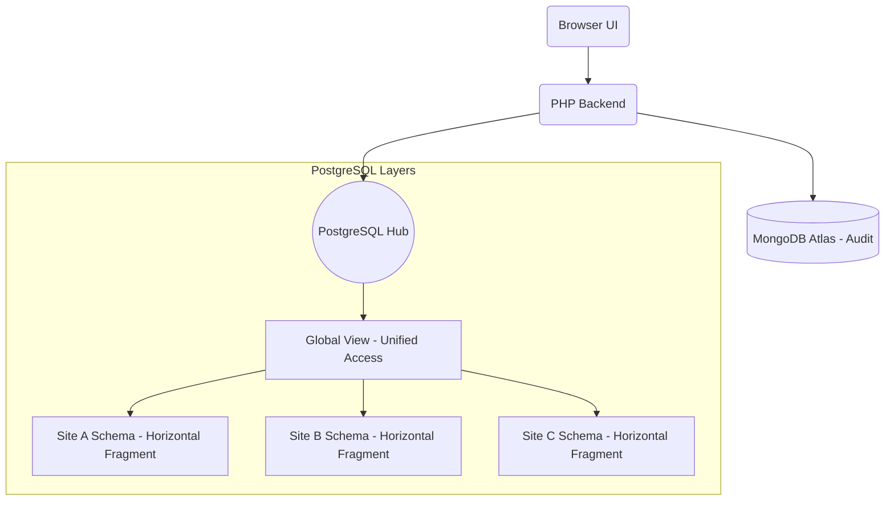

# 🎓 Hệ thống Cơ sở dữ liệu Phân tán HUFLIT (v2.0 - PostgreSQL Edition)

> Đồ án môn Cơ sở dữ liệu phân tán - Sử dụng **PostgreSQL (Schemas-based Distribution)** + **MongoDB Atlas (Audit Logs)** + **Modern UI/UX (Glassmorphism)**.

[](https://docker.com)
[](https://php.net)
[](https://www.postgresql.org/)
[](https://mongodb.com)

---

## ✨ Điểm nổi bật (New in v2.0)

- **Kiến trúc Hiện đại**: Thay thế SQL Server Linked Servers bằng PostgreSQL Schemas, giúp hệ thống nhẹ hơn, nhanh hơn và dễ dàng deploy lên Cloud (Neon.tech).
- **Giao diện Premium**: Sử dụng ngôn ngữ thiết kế **Glassmorphism 2.0** với font chữ Outfit/Inter, Mesh Gradient background và hiệu ứng chuyển động mượt mà.
- **Maintenance Tools**: Tích hợp sẵn Menu Quản trị để Reset Database, Nạp dữ liệu mẫu (Seed) và **Site Explorer** (So sánh dữ liệu thô giữa các Site).
- **Audit System**: Toàn bộ thao tác INSERT/UPDATE/DELETE được ghi nhận thời gian thực vào MongoDB Atlas.

---

## 🏗️ Kiến trúc hệ thống

Hệ thống mô phỏng một cơ sở dữ liệu phân tán gồm 3 Site vật lý thông qua các Schemas trong PostgreSQL:

- **Site A** (Mã khoa < 'M'): Lưu trữ các khoa như CNTT, DLKS, Kế toán...
- **Site B** ('M' ≤ Mã khoa < 'S'): Lưu trữ Ngôn ngữ, QTKD, Marketing...
- **Site C** (Mã khoa ≥ 'S'): Lưu trữ Sư phạm, Thể thao...
- **Replication**: Bảng Môn học được nhân bản đầy đủ trên cả 3 Site.

### Sơ đồ Logic:


---

## 🚀 Khởi động nhanh (Local Docker)

### 1. Clone & Start
```bash
git clone https://github.com/TienxDun/Distributed_Database.git
cd Distributed_Database
docker-compose up --build -d
```

### 2. URL truy cập
- 🏠 **Giao diện chính**: [http://localhost:8081/ui.php](http://localhost:8081/ui.php)
- ⚙️ **Quản trị hệ thống**: [http://localhost:8081/maintenance.php](http://localhost:8081/maintenance.php)
- 📋 **Nhật ký Audit**: [http://localhost:8081/logs.php](http://localhost:8081/logs.php)

---

## 📈 Kịch bản Demo khuyên dùng

1. **Làm sạch**: Truy cập mục **Quản trị** -> Nhấn **Reset Database**.
2. **Thêm mới**: Quay lại trang chủ, thêm 1 Khoa mới (VD: `MKT` - Marketing).
3. **Kiểm tra phân tán**: Vào **Site Explorer**, bạn sẽ thấy `MKT` chỉ xuất hiện tại **Site B**.
4. **Kiểm tra Audit**: Vào trang **Logs** để thấy lịch sử thực hiện thao tác vừa rồi trên MongoDB.

---

## 🌐 Triển khai Online (Deployment)

Dự án đã sẵn sàng để deploy lên **Render** và **Neon.tech**. 
Xem hướng dẫn chi tiết tại: [**DEPLOYMENT_INSTRUCTIONS.md**](./DEPLOYMENT_INSTRUCTIONS.md)

---

## 📁 Cấu trúc dự án tiêu biểu

- `/app/public/`: Chứa giao diện UI và các trang chức năng.
- `/app/routes/`: Logic API xử lý nghiệp vụ.
- `/app/db/`: Các script SQL khởi tạo và nạp dữ liệu.
- `docker-compose.yml`: Cấu hình môi trường chạy local.

---

© 2025 - Dự án CSDL Phân tán HUFLIT | [MIT License](LICENSE.md)
