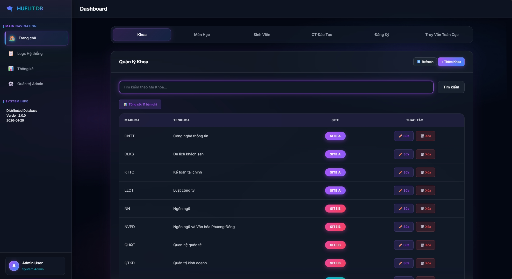

# 🎓 Distributed Database System - HUFLIT Graduation Project (v2.0)

[](https://www.postgresql.org/)
[](https://mongodb.com)
[](https://php.net)
[](https://docker.com)
[](https://opensource.org/licenses/MIT)

**🌐 Live Demo:** [https://distributed-database-tienxdun.onrender.com/](https://distributed-database-tienxdun.onrender.com/)

## 📌 Tổng quan dự án

Dự án mô phỏng một **Hệ quản trị Cơ sở dữ liệu Phân tán** thực tế, giải quyết bài toán quản lý dữ liệu quy mô lớn thông qua các kỹ thuật phân mảnh (fragmentation) và nhân bản (replication). Phiên bản 2.0 chuyển đổi toàn bộ kiến trúc từ MSSQL truyền thống sang **PostgreSQL Schemas-based Distribution**, mang lại hiệu năng cao và khả năng triển khai linh hoạt trên môi trường Cloud.

---

## 🛠️ Stack Công nghệ (Technical Stack)

- **Backend**: PHP 8.4 (Raw/Core) - Tối ưu hiệu năng, xử lý PDO & MongoDB Driver.
- **Primary Database**: PostgreSQL (với cơ chế Schemas & Triggers để điều phối dữ liệu).
- **Audit Database**: MongoDB Atlas - Lưu trữ nhật ký hệ thống (Write-ahead logs) dạng NoSQL.
- **Frontend**: Vanilla JS (Modules), CSS3 (Modern Glassmorphism UI), HTML5.
- **DevOps**: Docker, Docker Compose, Render.yaml, Neon.tech integration.

---

## 🏗️ Kiến trúc & Giải pháp kỹ thuật

### 1. Phân mảnh ngang (Horizontal Fragmentation)
Dữ liệu được chia thành 3 Site logic thông qua PostgreSQL Schemas:
- **Site A**: Quản lý các khoa từ A - L (CNTT, DLKS, ...).
- **Site B**: Quản lý các khoa từ M - R (Marketing, Ngôn ngữ, ...).
- **Site C**: Quản lý các khoa từ S - Z (Sư phạm, ...).

### 2. Nhân bản dữ liệu (Replication)
Bảng **Môn học** được nhân bản đầy đủ trên mọi Site, đảm bảo tính sẵn sàng cao và giảm thiểu độ trễ khi thực hiện các phép JOIN phức tạp.

### 3. Điều phối dữ liệu tự động (Automated Routing)
Sử dụng **PostgreSQL Triggers & Functions** trên lớp View hợp nhất. Khi người dùng thao tác dữ liệu (CRUD), hệ thống tự động nhận diện logic phân mảnh để đẩy dữ liệu về đúng Site tương ứng mà không cần Backend can thiệp sâu.

---

## ✨ Điểm nổi bật dành cho Nhà tuyển dụng

- **Khả năng thiết kế hệ thống**: Hiểu rõ nguyên lý phân tán, phân mảnh dữ liệu và xử lý xung đột.
- **Kỹ năng Database nâng cao**: Làm việc thành thạo với Schemas, Triggers, Functions, Views và tối ưu hóa truy vấn SQL.
- **Tư duy Full-stack**: Xây dựng UI hiện đại (Glassmorphism) kết hợp Backend xử lý logic nghiệp vụ chặt chẽ.
- **Integration**: Kết hợp linh hoạt giữa RDBMS (PostgreSQL) và NoSQL (MongoDB) trong cùng một hệ sinh thái.
- **Infrastructure-as-Code**: Đóng gói dự án hoàn chỉnh bằng Docker, sẵn sàng deploy chỉ với 1 câu lệnh.

---

## 🚀 Hướng dấn sử dụng nhanh

### Chạy bằng Docker
```powershell
docker-compose up --build -d
```
1. **Giao diện Dashboard**: [http://localhost:8081/](http://localhost:8081/)
2. **Hệ thống Audit Logs**: [http://localhost:8081/logs-ui](http://localhost:8081/logs-ui)
3. **Thống kê & Analytics**: [http://localhost:8081/stats-ui](http://localhost:8081/stats-ui)
4. **Quản trị Admin**:    [http://localhost:8081/maintenance-ui](http://localhost:8081/maintenance-ui)

### Import Dữ liệu Mẫu
Sau khi khởi động Docker, bạn cần import dữ liệu mẫu để UI hiển thị đầy đủ:

**Windows (Batch Script):**
```batch
.\seed_postgres_data.bat
```

**Linux/Mac (Bash Script):**
```bash
chmod +x seed_postgres_data.sh
./seed_postgres_data.sh
```

**PowerShell:**
```powershell
.\seed_postgres_data_v2.ps1
```

**Hoặc chạy thủ công:**
```bash
# Reset dữ liệu
docker-compose exec postgres psql -U admin -d huflit -c "TRUNCATE TABLE site_a.DangKy, site_a.SinhVien, site_a.CTDaoTao, site_a.Khoa, site_a.MonHoc CASCADE;"
docker-compose exec postgres psql -U admin -d huflit -c "TRUNCATE TABLE site_b.DangKy, site_b.SinhVien, site_b.CTDaoTao, site_b.Khoa, site_b.MonHoc CASCADE;"
docker-compose exec postgres psql -U admin -d huflit -c "TRUNCATE TABLE site_c.DangKy, site_c.SinhVien, site_c.CTDaoTao, site_c.Khoa, site_c.MonHoc CASCADE;"

# Import dữ liệu mẫu
docker-compose exec postgres psql -U admin -d huflit -f /docker-entrypoint-initdb.d/03_seed.sql
```

**Dữ liệu mẫu bao gồm:**
- **Site A**: 4 khoa, 32 sinh viên, 18 môn học (Khoa CNTT, DLKS, KTTC, LLCT)
- **Site B**: 4 khoa, 32 sinh viên, 20 môn học (Khoa NN, NVPD, QHQT, QTKD)
- **Site C**: 3 khoa, 24 sinh viên, 15 môn học (Khoa SLCT, SUAT, TLKS)

---

## 📊 Demo & Screenshots



- **Site Explorer**: Tính năng cho phép so sánh dữ liệu vật lý giữa các Site để kiểm chứng tính phân tán.
- **Real-time Audit**: Mọi thao tác đều được ghi lại vào MongoDB Atlas ngay lập tức.

---

## 👨‍💻 Tác giả
- **Phát triển bởi**: Lều Tiến Dũng - Sinh viên HUFLIT.
- **Liên hệ**: [leutiendung.hht@gmail.com](mailto:leutiendung.hht@gmail.com) | [LinkedIn](https://www.linkedin.com/in/leutiendung/)

---
© 2026 - HUFLIT Distributed Database Project | [LICENSE](LICENSE.md)
