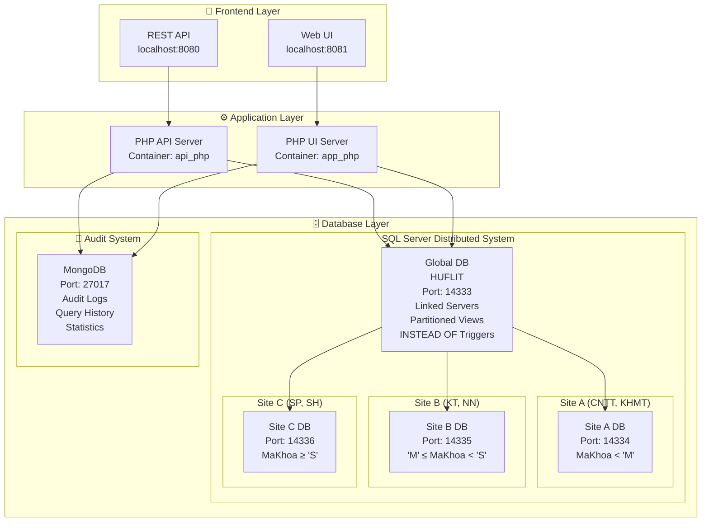
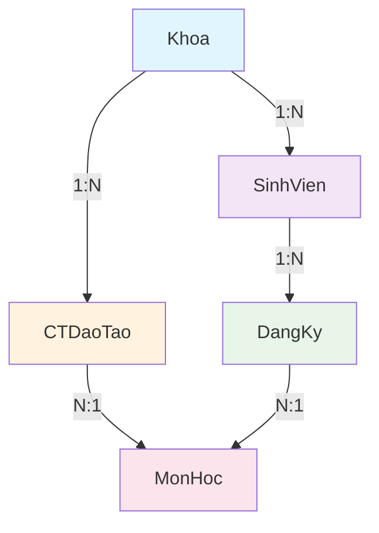

# 🎓 Hệ thống Cơ sở dữ liệu phân tán HUFLIT

> Đồ án môn Cơ sở dữ liệu phân tán - Sử dụng SQL Server (3 sites phân tán) + MongoDB (nhật ký kiểm tra) + Triển khai bằng Docker

[](https://docker.com)
[](https://php.net)
[](https://microsoft.com/sql-server)
[](https://mongodb.com)
[](https://opensource.org/licenses/MIT)

---

## 📋 Mục lục

- [🚀 Khởi động nhanh](#-khởi-động-nhanh)
- [🏗️ Kiến trúc hệ thống](#️-kiến-trúc-hệ-thống)
- [📁 Cấu trúc dự án](#-cấu-trúc-dự-án)
- [🛠️ Công nghệ sử dụng](#️-công-nghệ-sử-dụng)
- [📊 Cơ sở dữ liệu](#-cơ-sở-dữ-liệu)
- [🔧 Cài đặt và triển khai](#-cài-đặt-và-triển-khai)
- [📡 API Endpoints](#-api-endpoints)
- [🎨 Giao diện người dùng](#-giao-diện-người-dùng)
- [✨ Tính năng chính](#-tính-năng-chính)
- [🧪 Kiểm thử](#-kiểm-thử)
- [📚 Tài liệu tham khảo](#-tài-liệu-tham-khảo)
- [🤝 Đóng góp](#-đóng-góp)
- [📄 Giấy phép](#-giấy-phép)

---

## 🚀 Khởi động nhanh

### Yêu cầu hệ thống

- **Docker Desktop** phiên bản 4.0 trở lên
- **PowerShell** phiên bản 7.0 trở lên (Windows) hoặc Bash (Linux/Mac)
- **RAM**: 4GB trở lên (khuyến nghị 8GB)
- **Disk Space**: 5GB trở lên

### Cài đặt và chạy

1. **Clone repository:**
   ```bash
   git clone https://github.com/TienxDun/Distributed_Database.git
   cd Distributed_Database
   ```

2. **Khởi động các container:**
   ```powershell
   docker-compose up -d
   ```

3. **Khởi tạo cơ sở dữ liệu:**
   ```powershell
   .\init_databases.ps1
   ```

**Các URL truy cập:**

- 🏠 **Giao diện chính**: [http://localhost:8081/ui.php](http://localhost:8081/ui.php)
- 📋 **Nhật ký kiểm tra**: [http://localhost:8081/logs.php](http://localhost:8081/logs.php)
- 📊 **Thống kê**: [http://localhost:8081/stats.php](http://localhost:8081/stats.php)
- 🔌 **API Backend**: [http://localhost:8080](http://localhost:8080)

---

## 🏗️ Kiến trúc hệ thống

### Sơ đồ kiến trúc tổng quan



### Luồng dữ liệu

1. **Frontend** gửi request đến **API Gateway**
2. **PHP Application** xử lý logic nghiệp vụ
3. **Global Database** định tuyến request đến site phù hợp qua **INSTEAD OF Triggers**
4. **Site Database** thực hiện thao tác trên dữ liệu phân mảnh
5. **MongoDB** ghi lại nhật ký kiểm tra và thống kê

---

## 📁 Cấu trúc dự án

```
Distributed_Database/
├── 📄 ARCHITECTURE.md          # Tài liệu kiến trúc chi tiết
├── 📄 docker-compose.yml       # Cấu hình Docker containers
├── 📄 init_databases.ps1       # Script khởi tạo database
├── 📄 LICENSE.md               # Giấy phép MIT
├── 📄 Q&A_DoAn_DistributedDatabase.md  # Hỏi đáp đồ án
├── 📄 README.md                # Tài liệu này
├── 📁 app/                     # Source code ứng dụng
│   ├── 📄 common.php           # Database connection & utilities
│   ├── 📄 mongo_helper.php     # MongoDB operations
│   ├── 📄 request_logger.php   # API request logging
│   ├── 📁 public/              # Web root
│   │   ├── 📄 index.php        # API router
│   │   ├── 📄 router.php       # Route dispatcher
│   │   ├── 📄 ui.php           # Main UI page
│   │   ├── 📄 logs.php         # Audit logs page
│   │   ├── 📄 stats.php        # Statistics page
│   │   ├── 📄 sidebar.php      # Navigation sidebar
│   │   ├── 📁 css/             # Stylesheets
│   │   │   ├── 📄 base.css     # Base styles & variables
│   │   │   ├── 📄 components.css # UI components
│   │   │   ├── 📄 layout.css   # Layout & grid
│   │   │   ├── 📄 pages.css    # Page-specific styles
│   │   │   └── 📄 responsive.css # Mobile responsive
│   │   └── 📁 js/              # JavaScript modules
│   │       ├── 📄 app.js       # Main application
│   │       ├── 📄 config.js    # Configuration & constants
│   │       ├── 📁 modules/     # ES6 modules
│   │       │   ├── 📄 crud.js  # CRUD operations
│   │       │   ├── 📄 modal.js # Modal dialogs
│   │       │   ├── 📄 view.js  # Data display
│   │       │   └── 📄 global-query.js # Complex queries
│   │       └── 📁 utils/       # Utility functions
│   │           ├── 📄 api.js   # API client
│   │           ├── 📄 dom.js   # DOM manipulation
│   │           └── 📄 validation.js # Form validation
│   └── 📁 routes/              # API route handlers
│       ├── 📄 khoa.php         # Department management
│       ├── 📄 monhoc.php       # Course management
│       ├── 📄 sinhvien.php     # Student management
│       ├── 📄 ctdaotao.php     # Curriculum management
│       ├── 📄 dangky.php       # Enrollment management
│       ├── 📄 global.php       # Global queries
│       ├── 📄 logs.php         # Audit logs API
│       └── 📄 stats.php        # Statistics API
└── 📁 db/                      # Database initialization
    ├── 📁 global/              # Global database setup
    │   ├── 📄 init.sql         # Linked servers & views
    │   └── 📄 triggers.sql     # INSTEAD OF triggers
    ├── 📁 mongodb/             # MongoDB setup
    │   └── 📁 init/            # Initialization scripts
    │       └── 📄 init.js      # Create collections & indexes
    └── 📁 site_[a|b|c]/        # Site-specific databases
        ├── 📄 init.sql         # Schema creation
        └── 📄 seed.sql         # Sample data
```

---

## 🛠️ Công nghệ sử dụng

### Backend
- **PHP 8.4**: Server-side scripting
- **SQL Server 2022**: Relational database với phân mảnh ngang
- **MongoDB**: NoSQL database cho audit logs
- **PDO**: Database abstraction layer

### Frontend
- **Vanilla JavaScript (ES6 Modules)**: No frameworks, pure JavaScript
- **CSS3**: Custom properties, Grid, Flexbox
- **Chart.js**: Interactive charts và visualizations
- **HTML5**: Semantic markup

### DevOps & Tools
- **Docker & Docker Compose**: Containerization
- **PowerShell/Bash**: Automation scripts
- **Git**: Version control

### Libraries & Extensions
- **sqlsrv/pdo_sqlsrv**: SQL Server connectivity
- **mongodb**: MongoDB PHP driver
- **Chart.js**: Data visualization

---

## 📊 Cơ sở dữ liệu

### Schema quan hệ

| Bảng | Trường | Kiểu dữ liệu | Khóa | Mô tả | Site phân mảnh |
|------|--------|--------------|------|-------|----------------|
| **Khoa** | MaKhoa | NVARCHAR(10) | PK | Mã khoa duy nhất | A/B/C |
| | TenKhoa | NVARCHAR(100) | | Tên khoa | |
| **MonHoc** | MaMH | NVARCHAR(10) | PK | Mã môn học | All (Replicated) |
| | TenMH | NVARCHAR(100) | | Tên môn học | |
| **SinhVien** | MaSV | NVARCHAR(10) | PK | Mã sinh viên | A/B/C (theo MaKhoa) |
| | HoTen | NVARCHAR(100) | | Họ tên sinh viên | |
| | MaKhoa | NVARCHAR(10) | FK→Khoa | Khoa của sinh viên | |
| | KhoaHoc | INT | | Khóa học (năm nhập học) | |
| **CTDaoTao** | MaKhoa | NVARCHAR(10) | PK,FK→Khoa | Khoa đào tạo | A/B/C |
| | KhoaHoc | INT | PK | Khóa học | |
| | MaMH | NVARCHAR(10) | PK,FK→MonHoc | Môn học | |
| **DangKy** | MaSV | NVARCHAR(10) | PK,FK→SinhVien | Sinh viên đăng ký | A/B/C (theo MaKhoa SV) |
| | MaMon | NVARCHAR(10) | PK,FK→MonHoc | Môn học đăng ký | |
| | DiemThi | DECIMAL(4,2) | | Điểm thi (0-10) | |

### Quan hệ giữa các bảng



### Chiến lược phân mảnh

| Bảng | Chiến lược | Logic phân mảnh | Lý do |
|------|------------|------------------|-------|
| **Khoa** | Horizontal Partitioning | MaKhoa < 'M' → Site A<br>'M' ≤ MaKhoa < 'S' → Site B<br>MaKhoa ≥ 'S' → Site C | Phân bố đều theo alphabet |
| **MonHoc** | Full Replication | Tất cả sites | Cần thiết cho FK từ CTDaoTao & DangKy |
| **SinhVien** | Horizontal Partitioning | Theo MaKhoa của SV | Đảm bảo data locality |
| **CTDaoTao** | Horizontal Partitioning | Theo MaKhoa | Liên kết với Khoa |
| **DangKy** | Horizontal Partitioning | Theo MaKhoa của SV | Liên kết với SinhVien |

### Ràng buộc toàn vẹn

- **Khóa chính (Primary Key)**: Đảm bảo tính duy nhất
- **Khóa ngoại (Foreign Key)**: Đảm bảo tham chiếu hợp lệ
- **Ràng buộc check**: MaKhoa phải thuộc site đúng
- **Trigger INSTEAD OF**: Tự động định tuyến CRUD operations

### Ví dụ phân mảnh dữ liệu

```
Site A (MaKhoa < 'M'): CNTT, DLKS, KTTC, KTDN, LUAT
Site B ('M' ≤ MaKhoa < 'S'): MMT, NNA, NNPH, NNTR, QTKD  
Site C (MaKhoa ≥ 'S'): SPQT, TCNH, VHXH
```

### MongoDB Collections

#### `audit_logs` - Nhật ký kiểm tra
```javascript
{
  "_id": ObjectId,
  "table": "Khoa|SinhVien|MonHoc|CTDaoTao|DangKy",
  "operation": "INSERT|UPDATE|DELETE",
  "data": { /* new data */ },
  "old_data": { /* old data for UPDATE/DELETE */ },
  "timestamp": ISODate,
  "site": "Site_A|Site_B|Site_C|Global",
  "ip_address": "192.168.1.100",
  "user_agent": "Mozilla/5.0..."
}
```

#### `query_history` - Lịch sử truy vấn
```javascript
{
  "_id": ObjectId,
  "endpoint": "/khoa|/global|/stats",
  "method": "GET|POST|PUT|DELETE",
  "params": { "id": "CNTT" },
  "body": { /* request body */ },
  "execution_time_ms": 45,
  "result_count": 10,
  "status_code": 200,
  "timestamp": ISODate,
  "ip_address": "192.168.1.100"
}
```

### MongoDB Collections

#### `audit_logs`
```javascript
{
  table: "Khoa|SinhVien|...",
  operation: "INSERT|UPDATE|DELETE",
  data: {...},
  old_data: {...},
  timestamp: ISODate,
  site: "Site_A|Site_B|Site_C",
  ip_address: "x.x.x.x",
  user_agent: "..."
}
```

#### `query_history`
```javascript
{
  endpoint: "/khoa|/global|...",
  method: "GET|POST|PUT|DELETE",
  execution_time_ms: 123,
  result_count: 10,
  status_code: 200,
  timestamp: ISODate
}
```

---

## 🔧 Cài đặt và triển khai

### 1. Chuẩn bị môi trường

```bash
# Clone repository
git clone https://github.com/TienxDun/Distributed_Database.git
cd Distributed_Database

# Tạo file .env (nếu cần customize)
cp .env.example .env
```

### 2. Khởi động với Docker

```bash
# Build và start tất cả containers
docker-compose up -d

# Kiểm tra trạng thái containers
docker-compose ps

# Xem logs
docker-compose logs -f
```

### 3. Khởi tạo dữ liệu

```powershell
# Chạy script khởi tạo database
.\init_databases.ps1
```

### 4. Truy cập ứng dụng

- **Web UI**: http://localhost:8081/ui.php
- **API Docs**: http://localhost:8080 (JSON responses)
- **Database Ports**:
  - Global: 14333
  - Site A: 14334
  - Site B: 14335
  - Site C: 14336
  - MongoDB: 27017

### 5. Dừng và cleanup

```bash
# Dừng containers
docker-compose down

# Dừng và xóa volumes
docker-compose down -v

# Rebuild containers
docker-compose up -d --build
```

---

## 📡 API Endpoints

| Endpoint | Method | Description | Example |
|----------|--------|-------------|---------|
| `/khoa` | GET | Lấy danh sách khoa | `GET /khoa` |
| `/khoa?id=CNTT` | GET | Lấy khoa theo ID | `GET /khoa?id=CNTT` |
| `/khoa` | POST | Tạo khoa mới | `POST /khoa` + JSON body |
| `/khoa?id=CNTT` | PUT | Cập nhật khoa | `PUT /khoa?id=CNTT` + JSON |
| `/khoa?id=CNTT` | DELETE | Xóa khoa | `DELETE /khoa?id=CNTT` |
| `/monhoc` | GET/POST/PUT/DELETE | CRUD môn học | Tương tự khoa |
| `/sinhvien` | GET/POST/PUT/DELETE | CRUD sinh viên | Tương tự |
| `/ctdaotao` | GET/POST/PUT/DELETE | CRUD chương trình đào tạo | Tương tự |
| `/dangky` | GET/POST/PUT/DELETE | CRUD đăng ký | Tương tự |
| `/global?type=1` | GET | Môn học đã đạt của SV | `GET /global?type=1&masv=25DH001` |
| `/global?type=2` | GET | Khóa học của khoa | `GET /global?type=2&makhoa=CNTT` |
| `/global?type=3` | GET | Môn bắt buộc của SV | `GET /global?type=3&masv=25DH001` |
| `/global?type=4` | GET | SV đủ điều kiện tốt nghiệp | `GET /global?type=4` |
| `/logs` | GET | Nhật ký kiểm tra | `GET /logs?table=Khoa&limit=50` |
| `/stats` | GET | Thống kê hệ thống | `GET /stats?period=24h` |

### API Response Format

```json
{
  "success": true,
  "data": [...],
  "count": 10,
  "execution_time_ms": 45
}
```

```json
{
  "error": "Error message",
  "code": 500
}
```

---

## 🎨 Giao diện người dùng

### Tính năng chính

- **📊 Dashboard**: Tổng quan hệ thống với metrics real-time
- **🔄 CRUD Operations**: Tạo, đọc, cập nhật, xóa cho tất cả entities
- **🔍 Advanced Search**: Tìm kiếm và lọc dữ liệu
- **📈 Interactive Charts**: Biểu đồ thống kê với Chart.js
- **📱 Responsive Design**: Tương thích mọi thiết bị
- **⚙️ Settings Panel**: Cấu hình hiển thị và theme
- **🔄 Auto-refresh**: Tự động cập nhật dữ liệu

### JavaScript Architecture

- **ES6 Modules**: Modular code organization
- **Vanilla JS**: No heavy frameworks
- **Async/Await**: Modern asynchronous programming
- **Local Storage**: Client-side persistence

### CSS Architecture

- **CSS Custom Properties**: Dynamic theming
- **BEM Methodology**: Maintainable class naming
- **Mobile-first**: Responsive design approach
- **Dark Mode**: User preference support

---

## 📚 Tài liệu tham khảo

### Academic References
- [Distributed Database Systems - Özsu & Valduriez](https://www.springer.com/gp/book/9781441988331)
- [Database System Concepts - Silberschatz et al.](https://www.db-book.com/)

### Technical Documentation
- [SQL Server Linked Servers](https://docs.microsoft.com/en-us/sql/relational-databases/linked-servers/)
- [INSTEAD OF Triggers](https://docs.microsoft.com/en-us/sql/t-sql/statements/create-trigger-transact-sql)
- [MongoDB PHP Driver](https://docs.mongodb.com/php-library/)
- [Docker Compose](https://docs.docker.com/compose/)

### Related Projects
- [PostgreSQL FDW](https://wiki.postgresql.org/wiki/Foreign_data_wrappers)
- [MySQL Fabric](https://dev.mysql.com/doc/mysql-utilities/1.6/en/fabric.html)
- [Citus Data](https://www.citusdata.com/)

---

© 2025 - Đồ án môn Cơ sở dữ liệu phân tán HUFLIT | [MIT License](LICENSE.md)
