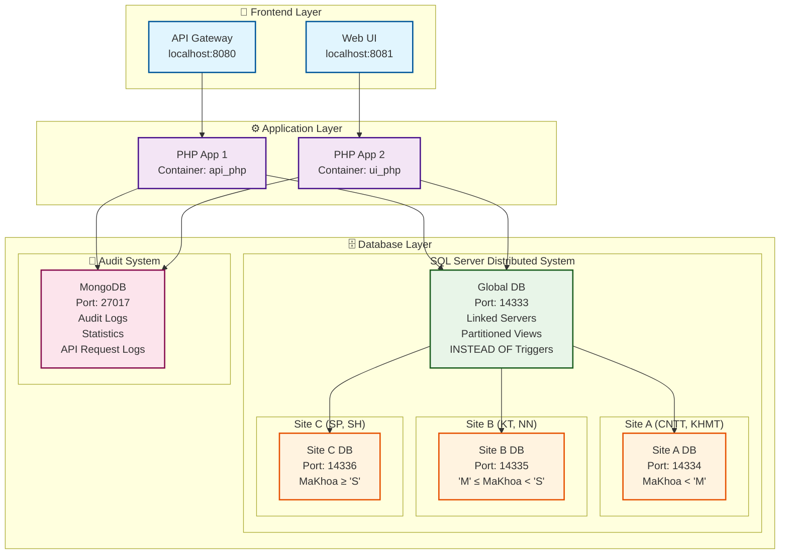
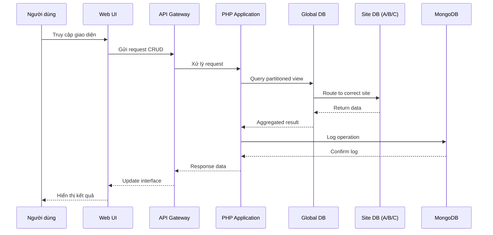

# 🎓 Hệ thống Cơ sở dữ liệu phân tán HUFLIT

> Đồ án môn Cơ sở dữ liệu phân tán - SQL Server (3 sites) + MongoDB (nhật ký kiểm tra) + Triển khai Docker

[](https://docker.com)
[](https://php.net)
[](https://microsoft.com/sql-server)
[](https://mongodb.com)
[](https://opensource.org/licenses/MIT)

---

## 📋 Mục lục

- [🚀 Khởi động nhanh](#-khởi-động-nhanh)
- [🏗️ Kiến trúc hệ thống](#️-kiến-trúc-hệ-thống)
- [✨ Tính năng chính](#-tính-năng-chính)
- [📡 API Endpoints](#-api-endpoints)
- [📁 Cấu trúc dự án](#-cấu-trúc-dự-án)
- [🎯 Demo](#-demo)
- [📄 Bản quyền](#-bản-quyền)

---

## 🚀 Khởi động nhanh

### Yêu cầu hệ thống

- **Docker Desktop** 4.0+
- **PowerShell** 7.0+
- **RAM**: 4GB+ (khuyến nghị 8GB)
- **Ổ cứng**: 10GB dung lượng trống

### Cài đặt và chạy

```powershell
# 1. Khởi động containers
docker-compose up -d

# 2. Khởi tạo cơ sở dữ liệu
.\init_databases.ps1
```

**URLs:**

- 🏠 **Giao diện chính**: [http://localhost:8081/ui.php](http://localhost:8081/ui.php)
- 📋 **Nhật ký kiểm tra**: [http://localhost:8081/logs.php](http://localhost:8081/logs.php)
- 📊 **Thống kê**: [http://localhost:8081/stats.php](http://localhost:8081/stats.php)
- 🔌 **API**: [http://localhost:8080](http://localhost:8080)

---

## 🏗️ Kiến trúc hệ thống

### Sơ đồ kiến trúc tổng quan



### Luồng dữ liệu trong hệ thống



### Thiết kế cơ sở dữ liệu

- **3 Sites SQL Server**: Phân mảnh theo khoảng giá trị `MaKhoa`
  - **Site A**: `MaKhoa < 'M'` (cổng 14334) - Công nghệ thông tin, Khoa học máy tính
  - **Site B**: `'M' ≤ MaKhoa < 'S'` (cổng 14335) - Kinh tế, Ngoại ngữ
  - **Site C**: `MaKhoa ≥ 'S'` (cổng 14336) - Sư phạm, Xã hội
- **Cơ sở dữ liệu toàn cục**: Máy chủ liên kết + Khung nhìn phân mảnh (cổng 14333)
- **MongoDB**: Nhật ký kiểm tra & phân tích (cổng 27017)

### Công nghệ sử dụng

- **Backend**: PHP 8.2 + PDO SQLSRV + Trình điều khiển MongoDB
- **Frontend**: JavaScript thuần (ES6 modules) + CSS3
- **Cơ sở dữ liệu**: SQL Server 2022 + MongoDB 6.0
- **Triển khai**: Docker Compose (6 containers)

---

## ✨ Tính năng chính

### 🔄 CRUD Operations

- **🏫 Khoa**: Quản lý khoa (đặc thù theo site)
- **📚 Môn Học**: Đồng bộ khóa học trên 3 sites
- **👨‍🎓 Sinh Viên**: Di chuyển sinh viên chéo sites
- **📋 Chương Trình Đào Tạo**: Chương trình học với xác thực khóa ngoại
- **✅ Đăng Ký**: Hệ thống đăng ký với JOIN phân tán

### 🌐 Tính năng phân tán

- **⚡ INSTEAD OF Triggers**: Tự động định tuyến thao tác về site đúng
- **📝 Nhật ký kiểm tra**: Theo dõi MongoDB cho tất cả thao tác
- **📊 Bảng thống kê**: Phân tích thời gian thực với biểu đồ
- **🔗 Truy vấn toàn cục**: 4 truy vấn phân tán phức tạp với JOIN

---

## 📡 API Endpoints

| Endpoint | Phương thức | Mô tả |
|----------|-------------|-------|
| `/khoa` | GET, POST, PUT, DELETE | CRUD Khoa |
| `/monhoc` | GET, POST, PUT, DELETE | Quản lý môn học (3 sites) |
| `/sinhvien` | GET, POST, PUT, DELETE | Thao tác sinh viên |
| `/ctdaotao` | GET, POST, DELETE | Quản lý chương trình đào tạo |
| `/dangky` | GET, POST, PUT, DELETE | Hệ thống đăng ký |
| `/global?type=1-4` | GET | Truy vấn toàn cục (4 loại) |
| `/logs` | GET | Nhật ký kiểm tra từ MongoDB |
| `/stats` | GET | Thống kê & phân tích |

---

## 📁 Cấu trúc dự án

```text
Distributed_Database/
├── docker-compose.yml          # 6 containers
├── init_databases.ps1          # Script thiết lập
├── app/
│   ├── public/
│   │   ├── ui.php              # Bảng điều khiển chính
│   │   ├── logs.php            # Giao diện nhật ký kiểm tra
│   │   ├── stats.php           # Giao diện thống kê
│   │   └── js/modules/         # Modules frontend
│   └── routes/                 # Xử lý API
└── db/
    ├── global/                 # Máy chủ liên kết & triggers
    ├── site_a/b/c/             # Schema theo site
    └── mongodb/init/           # Thiết lập MongoDB
```

---

## 🎯 Demo

- **Repository**: [GitHub](https://github.com/TienxDun/Distributed_Database)
- **Hệ thống trực tiếp**: [http://localhost:8081/ui.php](http://localhost:8081/ui.php) (sau khi thiết lập)

---

## 📄 Bản quyền

© 2025 - Đồ án môn Cơ sở dữ liệu phân tán HUFLIT

Dự án này được phát triển như một phần của chương trình học môn Cơ sở dữ liệu phân tán tại Trường Đại học HUFLIT.

**Giấy phép:** [MIT License](LICENSE.md)

**Công nghệ sử dụng:**

- Microsoft SQL Server 2022 (Enterprise Edition)
- MongoDB Community Edition
- PHP 8.2 với sqlsrv & mongodb extensions
- Docker & Docker Compose
- Chart.js cho trực quan hóa dữ liệu

---

🎓 Phát triển với ❤️ cho môn Cơ sở dữ liệu phân tán HUFLIT
