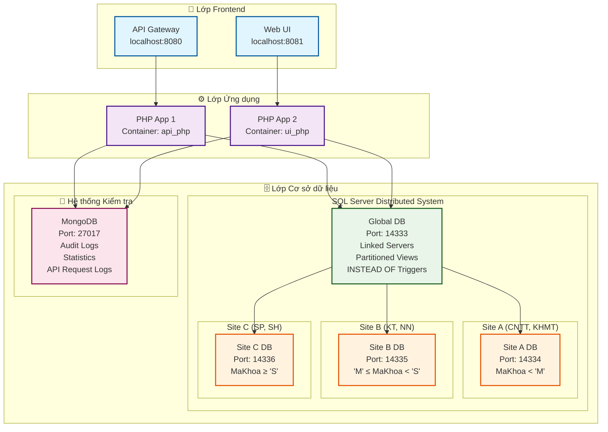
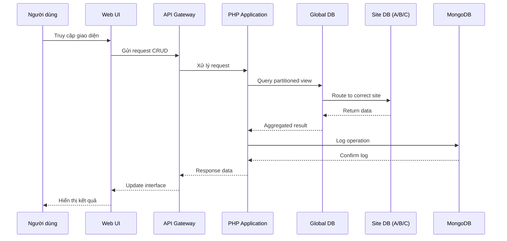

# 🎓 Hệ thống Cơ sở dữ liệu phân tán HUFLIT

> Đồ án môn Cơ sở dữ liệu phân tán - SQL Server (3 sites) + MongoDB (nhật ký kiểm tra) + Triển khai Docker

[](https://docker.com)
[](https://php.net)
[](https://microsoft.com/sql-server)
[](https://mongodb.com)
[](https://opensource.org/licenses/MIT)

---

## 🚀 Khởi động nhanh

### Yêu cầu hệ thống

- **Docker Desktop** 4.0+
- **PowerShell** 7.0+
- **RAM**: 4GB+ (khuyến nghị 8GB)

### Cài đặt và chạy

```powershell
# Khởi động containers
docker-compose up -d

# Khởi tạo cơ sở dữ liệu
.\init_databases.ps1
```

**URLs:**

- 🏠 **Giao diện chính**: [http://localhost:8081/ui.php](http://localhost:8081/ui.php)
- 📋 **Nhật ký kiểm tra**: [http://localhost:8081/logs.php](http://localhost:8081/logs.php)
- 📊 **Thống kê**: [http://localhost:8081/stats.php](http://localhost:8081/stats.php)

---

## 🏗️ Kiến trúc hệ thống

### Sơ đồ kiến trúc tổng quan



### Luồng dữ liệu trong hệ thống



### Thiết kế cơ sở dữ liệu

- **3 Sites SQL Server**: Phân mảnh theo `MaKhoa` (A: <'M', B: 'M'-'S', C: ≥'S')
- **Cơ sở dữ liệu toàn cục**: Máy chủ liên kết + Khung nhìn phân mảnh
- **MongoDB**: Nhật ký kiểm tra & phân tích

---

## ✨ Tính năng chính

- **🔄 CRUD Operations**: Khoa, Môn học, Sinh viên, Chương trình đào tạo, Đăng ký
- **🌐 Tính năng phân tán**: INSTEAD OF Triggers, Nhật ký MongoDB, Thống kê real-time
- **📊 Interactive Charts**: Chart.js với metrics thời gian thực

---

## 📡 API Endpoints

| Endpoint | Phương thức | Mô tả |
|----------|-------------|-------|
| `/khoa` | GET, POST, PUT, DELETE | CRUD Khoa |
| `/monhoc` | GET, POST, PUT, DELETE | Quản lý môn học |
| `/sinhvien` | GET, POST, PUT, DELETE | Thao tác sinh viên |
| `/global?type=1-4` | GET | Truy vấn toàn cục |
| `/logs` | GET | Nhật ký kiểm tra |
| `/stats` | GET | Thống kê |

---

## 🚀 Deploy Online (MIỄN PHÍ)

### 💰 **Deploy với chi phí = 0**

Dự án này có thể deploy hoàn toàn **MIỄN PHÍ** lên cloud platforms:

#### 🎯 **Quick Start (15 phút)**
```bash
# 1. Chuẩn bị
cp .env.example .env  # Edit với password mạnh

# 2. Railway: SQL Server (5 phút)
# Truy cập railway.app → Deploy from GitHub

# 3. Render: Web + MongoDB (10 phút)
# Truy cập render.com → Deploy Web Service + MongoDB

# 4. Done! Website online tại:
# https://your-app.onrender.com/ui.php
```

#### 📋 **Hướng dẫn chi tiết**
- **Quick Start**: [QUICK_START.md](QUICK_START.md)
- **TODO List**: [TODO_DEPLOY.md](TODO_DEPLOY.md)
- **Free Deploy Guide**: [FREE_DEPLOY.md](FREE_DEPLOY.md)
- **All Options**: [DEPLOY_GUIDE.md](DEPLOY_GUIDE.md)

#### 🎯 **Kết quả**
- ✅ **Domain**: Auto-generated (SSL miễn phí)
- ✅ **Database**: SQL Server 3 sites + MongoDB
- ✅ **Scaling**: Auto-scaling
- ✅ **Monitoring**: Built-in dashboards

---

## 🎯 Demo

**Repository**: [GitHub](https://github.com/TienxDun/Distributed_Database)

**Hệ thống trực tiếp**: [http://localhost:8081/ui.php](http://localhost:8081/ui.php)

---

© 2025 - Đồ án môn Cơ sở dữ liệu phân tán HUFLIT | [MIT License](LICENSE.md)
