# 🎓 Hệ thống Cơ sở dữ liệu phân tán HUFLIT

> Đồ án môn Cơ sở dữ liệu phân tán - Sử dụng SQL Server (3 sites phân tán) + MongoDB (nhật ký kiểm tra) + Triển khai bằng Docker

[](https://docker.com)
[](https://php.net)
[](https://microsoft.com/sql-server)
[](https://mongodb.com)
[](https://opensource.org/licenses/MIT)

---

## 🚀 Khởi động nhanh

### Yêu cầu hệ thống

- **Docker Desktop** phiên bản 4.0 trở lên
- **PowerShell** phiên bản 7.0 trở lên
- **RAM**: 4GB trở lên (khuyến nghị 8GB)

### Cài đặt và chạy

```powershell
# Khởi động các container
docker-compose up -d

# Khởi tạo cơ sở dữ liệu
.\init_databases.ps1
```

**Các URL truy cập:**

- 🏠 **Giao diện chính**: [http://localhost:8081/ui.php](http://localhost:8081/ui.php)
- 📋 **Nhật ký kiểm tra**: [http://localhost:8081/logs.php](http://localhost:8081/logs.php)
- 📊 **Thống kê**: [http://localhost:8081/stats.php](http://localhost:8081/stats.php)

---

## 🏗️ Kiến trúc hệ thống

### Sơ đồ kiến trúc tổng quan

```mermaid
graph TB
    %% User Interface
    subgraph "🎨 Lớp Frontend"
        UI[Web UI<br/>localhost:8081]
        API[API Gateway<br/>localhost:8080]
    end

    %% Application Layer
    subgraph "⚙️ Lớp Ứng dụng"
        PHP1[PHP App 1<br/>Container: api_php]
        PHP2[PHP App 2<br/>Container: ui_php]
    end

    %% Database Layer
    subgraph "🗄️ Lớp Cơ sở dữ liệu"
        subgraph "SQL Server Distributed System"
            GLOBAL[Global DB<br/>Port: 14333<br/>Linked Servers<br/>Partitioned Views<br/>INSTEAD OF Triggers]

            subgraph "Site A (CNTT, KHMT)"
                SITE_A[Site A DB<br/>Port: 14334<br/>MaKhoa < 'M']
            end

            subgraph "Site B (KT, NN)"
                SITE_B[Site B DB<br/>Port: 14335<br/>'M' ≤ MaKhoa < 'S']
            end

            subgraph "Site C (SP, SH)"
                SITE_C[Site C DB<br/>Port: 14336<br/>MaKhoa ≥ 'S']
            end
        end

        subgraph "📝 Hệ thống Kiểm tra"
            MONGO[MongoDB<br/>Port: 27017<br/>Audit Logs<br/>Statistics<br/>API Request Logs]
        end
    end

    %% Data Flow
    UI --> PHP2
    API --> PHP1
    PHP1 --> GLOBAL
    PHP2 --> GLOBAL

    GLOBAL --> SITE_A
    GLOBAL --> SITE_B
    GLOBAL --> SITE_C

    PHP1 --> MONGO
    PHP2 --> MONGO

    %% Styling
    classDef frontend fill:#e1f5fe,stroke:#01579b,stroke-width:2px
    classDef app fill:#f3e5f5,stroke:#4a148c,stroke-width:2px
    classDef db fill:#e8f5e8,stroke:#1b5e20,stroke-width:2px
    classDef site fill:#fff3e0,stroke:#e65100,stroke-width:2px
    classDef mongo fill:#fce4ec,stroke:#880e4f,stroke-width:2px

    class UI,API frontend
    class PHP1,PHP2 app
    class GLOBAL db
    class SITE_A,SITE_B,SITE_C site
    class MONGO mongo
```



### Luồng dữ liệu trong hệ thống

```mermaid
sequenceDiagram
    participant U as Người dùng
    participant UI as Web UI
    participant API as API Gateway
    participant PHP as PHP Application
    participant GLOBAL as Global DB
    participant SITE as Site DB (A/B/C)
    participant MONGO as MongoDB

    U->>UI: Truy cập giao diện
    UI->>API: Gửi request CRUD
    API->>PHP: Xử lý request

    PHP->>GLOBAL: Query partitioned view
    GLOBAL->>SITE: Route to correct site
    SITE-->>GLOBAL: Return data
    GLOBAL-->>PHP: Aggregated result

    PHP->>MONGO: Log operation
    MONGO-->>PHP: Confirm log

    PHP-->>API: Response data
    API-->>UI: Update interface
    UI-->>U: Hiển thị kết quả
```



### Thiết kế cơ sở dữ liệu

- **3 Sites SQL Server**: Phân mảnh theo `MaKhoa` (A: <'M', B: 'M'-'S', C: ≥'S')
- **Cơ sở dữ liệu toàn cục**: Máy chủ liên kết + Khung nhìn phân mảnh
- **MongoDB**: Nhật ký kiểm tra & phân tích dữ liệu

---

## ✨ Tính năng chính

- **🔄 CRUD Operations**: Khoa, Môn học, Sinh viên, Chương trình đào tạo, Đăng ký
- **🌐 Tính năng phân tán**: INSTEAD OF Triggers, Nhật ký MongoDB, Thống kê real-time
- **📊 Interactive Charts**: Chart.js với metrics thời gian thực

---

## 📡 API Endpoints

| Endpoint | Phương thức | Mô tả |
|----------|-------------|-------|
| `/khoa` | GET, POST, PUT, DELETE | CRUD Khoa |
| `/monhoc` | GET, POST, PUT, DELETE | Quản lý môn học |
| `/sinhvien` | GET, POST, PUT, DELETE | Thao tác sinh viên |
| `/global?type=1-4` | GET | Truy vấn toàn cục |
| `/logs` | GET | Nhật ký kiểm tra |
| `/stats` | GET | Thống kê hệ thống |

---

## 🎯 Demo

**Repository**: [GitHub](https://github.com/TienxDun/Distributed_Database)

**Hệ thống trực tiếp**: [http://localhost:8081/ui.php](http://localhost:8081/ui.php)

---

© 2025 - Đồ án môn Cơ sở dữ liệu phân tán HUFLIT | [MIT License](LICENSE.md)
