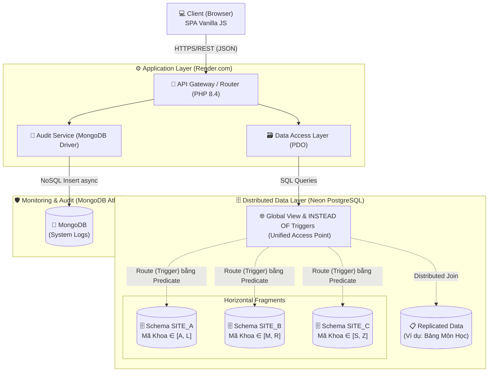

# 🏗️ System Architecture - HUFLIT Distributed Database

## 📌 1. Executive Summary (Tổng quan dự án)
Hệ thống **HUFLIT Distributed Database** là một ứng dụng minh họa các khái niệm cốt lõi của **Hệ quản trị CSDL Phân tán (Distributed DBMS)**. Dự án tập trung giải quyết bài toán phân mảnh dữ liệu (Data Fragmentation), đảm bảo tính trong suốt phân tán (Distribution Transparency) và tối ưu hóa truy vấn thông qua cơ chế nhân bản (Replication). 

Điểm nhấn kỹ thuật của dự án là hành trình **Migration từ cấu trúc MSSQL Linked Servers tĩnh sang mô hình PostgreSQL Schemas**, giúp tối ưu hóa chi phí vận hành trên Cloud mà vẫn giữ nguyên được bản chất kiến trúc định tuyến luồng dữ liệu (Data Routing).

**Tech Stack:**
- **Frontend**: Vanilla JavaScript (ES6 Modules), CSS Variables, Glassmorphism UI (No Frameworks).
- **Backend**: Native PHP 8.4 (PDO), RESTful API Design.
- **Database**: PostgreSQL (Neon.tech Serverless), MongoDB Atlas (Audit Logging).
- **Infrastructure**: Render.com, Cloud Database Hosting.

---

## 📐 2. High-Level Architecture (Kiến trúc tổng thể)

Hệ thống tuân thủ nghiêm ngặt mô hình **n-Tier Architecture**, tách biệt hoàn toàn giữa Web UI, Business/Routing Logic và Data Access.

---

## 🧠 3. Core Engineering Decisions & Trade-offs (Quyết định kỹ thuật)

Là một Software Engineer, mọi thiết kế hệ thống đều đòi hỏi sự đánh đổi (Trade-offs). Dưới đây là các phân tích hệ thống đằng sau dự án:

### 3.1. PostgreSQL Schemas thay thế Physical Servers
- **Context**: Triển khai CSDL phân tán truyền thống yêu cầu nhiều cụm máy chủ vật lý giao tiếp qua môi trường mạng (như Local Publication/Subscription), dẫn đến chi phí duy trì Cloud rất lớn và phức tạp trong CI/CD.
- **Decision**: Mô phỏng các phân mảnh mạng lưới bằng tính năng **Schemas** của PostgreSQL trên một cụm Database Serverless (Neon.tech). Tách biệt logical schema thay vì physical node.
- **Pros (Ưu điểm)**: Tiết kiệm 90% chi phí hạ tầng, dễ dàng scale, thời gian khởi tạo/triển khai nhanh, vẫn thể hiện được đầy đủ logic Routing và Fragmentation của một Distributed DB.
- **Cons (Nhược điểm)**: Đánh đổi **Fault Tolerance (Khả năng chịu lỗi)** về mặt vật lý. Single Point of Failure: Nếu cụm Neon down, toàn bộ các Site sẽ mất kết nối.
- **Mitigation**: Đối với mục đích Proof of Concept và học thuật/portfolio, việc ưu tiên tối ưu chi phí (Cost optimization) và mô phỏng cơ chế điều hướng (Routing mechanism) là một thiết kế thực tế và hợp lý.

### 3.2. Polyglot Persistence (Sử dụng đa cơ sở dữ liệu)
- **Decision**: Sử dụng PostgreSQL (RDBMS) cho các giao dịch ACID lõi, đồng thời dùng MongoDB (NoSQL) riêng biệt cho việc ghi nhận Audit Logs.
- **Pros**: Phân tách tải (Load separation). Write-heavy operations (như logging) không làm chậm các truy vấn read/write chính của người dùng trên hệ CSDL quan hệ.
- **Cons**: Tăng độ phức tạp của hệ thống (phải quản lý 2 Database connections trong Backend).

### 3.3. Vanilla JS over React/Angular
- **Decision**: Tự xây dựng Frontend SPA (Single Page Application) bằng Vanilla JS, ES6 Modules.
- **Pros**: Chứng minh sự am hiểu sâu sắc về DOM manipulation định tuyến trên Client, Web API, Event Loop và tối ưu hiệu suất (Zero-dependency, bundle size cực nhỏ, tải trang siêu nhẹ). Đặc biệt phù hợp cho các Dashboard quản trị tập trung vào Data.

---

## 🧩 4. Distributed Data Mechanics (Cơ chế Phân tán ứng dụng)

Theo chuẩn thiết kế của Hệ Cơ sở dữ liệu phân tán, dự án đảm bảo 3 mức độ trong suốt (Transparency):

1. **Fragmentation Transparency (Tính trong suốt phân mảnh)**:
   - Áp dụng **Phân mảnh ngang (Horizontal Fragmentation)** trên dữ liệu (VD: Bảng SinhVien) với tập điều kiện (Predicate) `MaKhoa`.
   - `SITE_A` chuyên trách dữ liệu Khoa (A-L), `SITE_B` (M-R), `SITE_C` (S-Z).

2. **Replication Transparency (Tính trong suốt nhân bản)**:
   - Các dữ liệu danh mục, cấu hình, hoặc bảng read-heavy (VD: bảng `MonHoc`) được tạo bản sao toàn phần (Full Replication) trên hệ thống để tối ưu hóa quá trình thực thi truy vấn phân tán (Distributed Query Processing). Tránh việc luân chuyển gói dữ liệu lớn qua mạng khi thực hiện lệnh JOIN.

3. **Location/Routing Transparency (Tính trong suốt vị trí)**:
   - Application Layer (Web/API) **KHÔNG CẦN BIẾT** mảnh dữ liệu cụ thể đang được lưu ở vị trí vật lý nào.
   - Ứng dụng chỉ định tuyến các lệnh truy vấn (CRUD) vào `Global Views` (Hệ khung nhìn tổng hợp UNION ALL).
   - Hệ quản trị tự động xử lý điều hướng thông qua **INSTEAD OF Triggers**. Khi ứng dụng INSERT vào View tổng, Trigger sẽ phân tích biểu thức dữ liệu `MaKhoa` và chủ động định tuyến (Route) thao tác ghi (Write) về đúng Node (Schema) vật lý phù hợp mà không cần ứng dụng phải viết logic If/Else.

---

## 🛡️ 5. Security Practices & Code Quality

- **SQL Injection Prevention**: 100% các Data Access routines đều sử dụng **PDO Prepared Statements** kết hợp ràng buộc chặt chẽ tham số đầu vào.
- **XSS Prevention**: Các input đầu vào từ người dùng trên giao diện Vanilla JS được escape hoặc tuân thủ cơ chế context validation trước khi render.
- **Stateless API Design**: API Layer hoạt động tập trung theo nguyên tắc REST, không lưu trạng thái session cục bộ, chuẩn bị tốt cho kịch bản Scale out số lượng web servers (dùng Load Balancer nếu cần).

